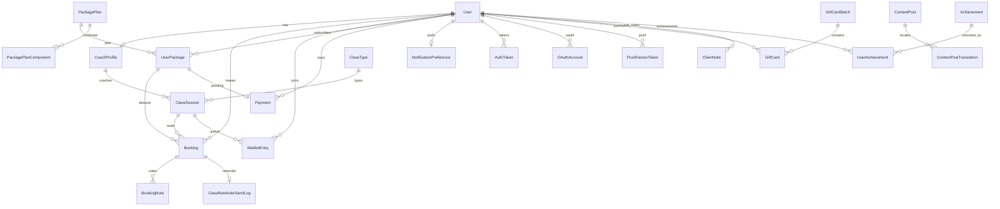
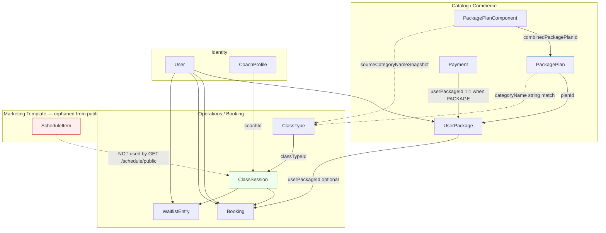

# Ommm — Complete Project Analysis (English)

**Document purpose:** Exhaustive inventory of everything implemented in the Ommm monorepo — every page, block, API endpoint, mobile screen, database entity, background job, and cross-cutting system — with a clear description of **what exists** and **what it does**.

**Last mapped from codebase:** June 2026  
**Repository layout:** `apps/web`, `apps/api`, `apps/mobile`, `packages/database`

---

## Table of Contents

1. [Executive Summary](#1-executive-summary)
2. [Monorepo Structure](#2-monorepo-structure)
3. [Technology Stack](#3-technology-stack)
4. [User Roles and Access Control](#4-user-roles-and-access-control)
5. [Internationalization (i18n)](#5-internationalization-i18n)
6. [Web Application — Complete Page Catalog](#6-web-application--complete-page-catalog)
7. [Web — Marketing Home Page Blocks](#7-web--marketing-home-page-blocks)
8. [Web — Public Marketing Pages (Functional Detail)](#8-web--public-marketing-pages-functional-detail)
9. [Web — Authentication Pages](#9-web--authentication-pages)
10. [Web — Member (USER) Area — Full Feature Breakdown](#10-web--member-user-area--full-feature-breakdown)
11. [Web — Coach Area — Full Feature Breakdown](#11-web--coach-area--full-feature-breakdown)
12. [Web — Manager Area — Full Feature Breakdown](#12-web--manager-area--full-feature-breakdown)
13. [Web — Admin Area — Full Feature Breakdown](#13-web--admin-area--full-feature-breakdown)
14. [Web — Content Admin Area](#14-web--content-admin-area)
15. [Web — Shared UI Shell and Layout Systems](#15-web--shared-ui-shell-and-layout-systems)
16. [Web — Component Domains (File Inventory)](#16-web--component-domains-file-inventory)
17. [API — Complete Endpoint Reference](#17-api--complete-endpoint-reference)
18. [API — Module Responsibilities (Business Logic)](#18-api--module-responsibilities-business-logic)
19. [Mobile Application — Complete Screen Catalog](#19-mobile-application--complete-screen-catalog)
20. [Database — All Models and What They Enable](#20-database--all-models-and-what-they-enable) (+ [20.7–20.11 complete schema](#207-complete-schema--every-model-and-field))
21. [Database — All Enums](#21-database--all-enums)
22. [End-to-End Business Flows](#22-end-to-end-business-flows)
23. [Payment System (Full Flow)](#23-payment-system-full-flow)
24. [Gift Card System (Full Flow)](#24-gift-card-system-full-flow)
25. [Waitlist System (Full Flow)](#25-waitlist-system-full-flow)
26. [Content CMS Workflow](#26-content-cms-workflow)
27. [Notifications and Email System](#27-notifications-and-email-system)
28. [Realtime SSE System](#28-realtime-sse-system)
29. [Background Jobs (Cron)](#29-background-jobs-cron)
30. [Uploads and File Storage](#30-uploads-and-file-storage)
31. [Security Baseline](#31-security-baseline)
32. [Environment Variables](#32-environment-variables)
33. [Development Commands](#33-development-commands)
34. [Testing](#34-testing)
35. [Deployment References](#35-deployment-references)
36. [Domain Architecture — Classes, Schedule, Packages (Current State)](#36-domain-architecture--classes-schedule-packages-current-state)
37. [Implementation Maturity Notes](#37-implementation-maturity-notes)

---

## 1. Executive Summary

**Ommm** is a production-oriented wellness/studio platform that unifies:

| Surface | Purpose |
|---------|---------|
| **Public web** | Brand marketing, schedule, coaches, packages, content, contact |
| **Member app (web + mobile)** | Book classes, manage packages, payments, gift cards, progress |
| **Staff dashboards (web)** | Coach, manager, content admin, and full admin backoffice |
| **REST API** | Single backend for all clients with JWT auth, RBAC, and domain services |
| **PostgreSQL + Prisma** | Shared domain model across web, API, and mobile |

The platform supports **5 roles** (`USER`, `COACH`, `MANAGER`, `CONTENT_ADMIN`, `ADMIN`), **96 web routes**, **19 API controller groups**, **~130 REST endpoints**, **32 mobile screens**, and **27 Prisma models**.

---

## 2. Monorepo Structure

```
ommm/
├── apps/
│   ├── web/          Next.js 16 App Router — marketing + dashboards
│   ├── api/          NestJS 11 REST API — /v1/*
│   └── mobile/       Expo 54 — expo-router, member-first
├── packages/
│   └── database/     Prisma schema, migrations, seed, @ommm/database client
├── docs/             Architecture, design, deploy, analysis docs
├── scripts/          Dev helpers (dev-guide.cjs)
├── .cursor/rules/    Cursor AI coding rules
├── .github/          PR templates, Dependabot
├── .env.example      Shared environment contract
├── pnpm-workspace.yaml
└── package.json      Root scripts (dev:web, dev:api, build, test)
```

---

## 3. Technology Stack

| Layer | Technology | Notes |
|-------|------------|-------|
| Monorepo | pnpm workspaces | `apps/*`, `packages/database` |
| Web | Next.js 16, React 19 | App Router, server components, middleware |
| Web i18n | next-intl | Locales: `en`, `hy`, `ru` |
| Web styling | Tailwind CSS 4 | Design tokens in `tokens.css`, module CSS for marketing |
| API | NestJS 11 | Passport JWT, class-validator, ScheduleModule, Throttler |
| API logging | pino | Structured logs |
| API security | helmet, CORS, throttler | Production hardening |
| Mobile | Expo 54, expo-router | SecureStore for tokens, push registration |
| Database | PostgreSQL | Neon-compatible |
| ORM | Prisma 6 | Migrations + seed |
| Auth | JWT (cookie + Bearer) | Google OAuth optional |
| Email | Resend (or log transport) | Transactional + campaigns |
| Storage | Cloudflare R2 + local fallback | Profile images, content covers, gift art |
| Payments | Manual admin confirm + Arca gateway | Pending → confirm → side effects |
| Realtime | SSE | Public + authenticated event streams |
| Cache | Upstash Redis (optional) | API cache module |
| Testing | Jest (API), Playwright (web e2e) | |

---

## 4. User Roles and Access Control

### 4.1 Roles

| Role | Description | Default home (web) |
|------|-------------|-------------------|
| `USER` | Studio member / client | `/user` (account hub) |
| `COACH` | Instructor | `/coach/home` |
| `MANAGER` | Day-to-day operations | `/manager/home` |
| `CONTENT_ADMIN` | Editorial / CMS | `/content-admin/home` |
| `ADMIN` | Full platform control | `/admin/dashboard` |

### 4.2 Access Enforcement

- **API:** `JwtAuthGuard` validates JWT from httpOnly cookie or `Authorization: Bearer`. `RolesGuard` checks `@Roles(...)` decorator on endpoints.
- **Web:** Server layouts call `requireAuthForLayout` and `redirectIfRoleNotIn` (`apps/web/src/server/require-role-layout.ts`).
- **Blocked users:** `User.isBlocked = true` prevents login and booking.

### 4.3 Navigation Source of Truth

Role sidebar items are defined in `apps/web/src/lib/dashboard-nav.ts`:

- **USER:** dashboard (account hub), bookings, waitlists, packages, payments, gift cards, profile
- **COACH:** dashboard, schedule, groups, salary, analytics, profile
- **MANAGER:** home, schedule (classes), bookings, waitlists, clients, coaches, gift cards, profile
- **CONTENT_ADMIN:** home, content, profile
- **ADMIN:** dashboard, bookings, waitlists, clients, coaches, schedule, packages, gift cards, finance, analytics, notifications, content, settings, guest-users

---

## 5. Internationalization (i18n)

- **Locales:** `en`, `hy`, `ru` (`apps/web/src/i18n/routing.ts`)
- **URL pattern:** Always prefixed — `/{locale}/...`
- **Default locale:** `en`
- **Locale detection:** Disabled (URL drives locale)
- **Message files:** `apps/web/src/messages/en.json`, `hy.json`, `ru.json`
- **User locale:** Stored on `User.locale`, updated via `PATCH /v1/users/me` and language switcher
- **Content translations:** `ContentPostTranslation` model — per-locale slug, title, body, SEO fields

---

## 6. Web Application — Complete Page Catalog

All routes below are under `/{locale}/` unless noted. **96 `page.tsx` files** exist under `apps/web/src/app`.

### 6.1 Root

| Route | What it does |
|-------|--------------|
| `/` | Redirects to localized default route |

### 6.2 Marketing (public)

| Route | What it does |
|-------|--------------|
| `/{locale}` | Public homepage (hero, classes, coaches, plans, gallery, footer) |
| `/{locale}/story` | Brand story / about page |
| `/{locale}/explore` | Published content listing (blog, news, events) |
| `/{locale}/explore/[slug]` | Single content article by slug |
| `/{locale}/schedule` | Public weekly schedule + bookable sessions |
| `/{locale}/coaches` | Public coach directory |
| `/{locale}/packages` | Package catalog (all categories) |
| `/{locale}/packages/[categoryKey]` | Packages filtered by category |
| `/{locale}/package` | Package entry alias |
| `/{locale}/membership` | Membership entry alias |
| `/{locale}/memberships` | Memberships listing alias |
| `/{locale}/contact` | Contact form + map + studio info |

### 6.3 Auth

| Route | What it does |
|-------|--------------|
| `/{locale}/login` | Email/password login + Google OAuth link |
| `/{locale}/register` | New account registration |
| `/{locale}/forgot-password` | Request password reset email |
| `/{locale}/reset-password` | Set new password with reset token |
| `/{locale}/verify-email` | Confirm email with verification token |
| `/{locale}/set-password` | First-time password for OAuth / empty-password users |

### 6.4 Account entry

| Route | What it does |
|-------|--------------|
| `/{locale}/account` | Post-login router → role home |
| `/{locale}/dashboard` | Legacy/alternate dashboard entry |

### 6.5 Member (USER)

| Route | What it does |
|-------|--------------|
| `/{locale}/user` | Member account hub (next class, waitlist, achievements, quick nav) |
| `/{locale}/user/dashboard` | Dashboard variant of member hub |
| `/{locale}/user/bookings` | My bookings list + cancel |
| `/{locale}/user/waitlists` | My waitlist entries |
| `/{locale}/user/packages` | My active/pending packages |
| `/{locale}/user/packages/[categoryKey]` | Browse/subscribe packages by category |
| `/{locale}/user/payments` | Payment history |
| `/{locale}/user/payments/checkout` | Arca / pending payment checkout |
| `/{locale}/user/payments/success` | Payment success landing |
| `/{locale}/user/payments/fail` | Payment failure landing |
| `/{locale}/user/gift-cards` | Purchased/received gift cards, redeem, buy |
| `/{locale}/user/gift-cards/fake-payment` | Dev/test gift payment helper |
| `/{locale}/user/gift-cards/payment-result` | Gift payment result page |
| `/{locale}/user/progress` | Attendance analytics + achievements |
| `/{locale}/user/profile` | Edit profile (name, phone, DOB, avatar, locale) |
| `/{locale}/user/settings` | Account settings |
| `/{locale}/user/notifications` | Notification preference toggles |

**Intercepted sheet routes (mobile UX):**

| Route | What it does |
|-------|--------------|
| `/{locale}/user/@sheet/(.)bookings` | Bottom sheet overlay for bookings |
| `/{locale}/user/@sheet/(.)waitlists` | Bottom sheet for waitlists |
| `/{locale}/user/@sheet/(.)packages` | Bottom sheet for packages |
| `/{locale}/user/@sheet/(.)payments` | Bottom sheet for payments |
| `/{locale}/user/@sheet/(.)gift-cards` | Bottom sheet for gift cards |
| `/{locale}/user/@sheet/(.)profile` | Bottom sheet for profile |
| `/{locale}/user/@sheet/(.)notifications` | Bottom sheet for notifications |

### 6.6 Coach

| Route | What it does |
|-------|--------------|
| `/{locale}/coach` | Coach area root / redirect |
| `/{locale}/coach/home` | Coach dashboard summary |
| `/{locale}/coach/schedule` | Coach's upcoming sessions calendar |
| `/{locale}/coach/groups` | Session rosters / attendee groups |
| `/{locale}/coach/salary` | Coach earnings / salary summary |
| `/{locale}/coach/analytics` | Performance KPIs and trends |
| `/{locale}/coach/profile` | Coach profile edit |
| `/{locale}/coach/settings` | Coach settings |
| `/{locale}/coach/notifications` | Notification preferences |

### 6.7 Manager

| Route | What it does |
|-------|--------------|
| `/{locale}/manager/home` | Operations KPI dashboard |
| `/{locale}/manager/classes` | Schedule / class grid (admin UI reuse) |
| `/{locale}/manager/bookings` | Booking management (attendance, notes, move) |
| `/{locale}/manager/waitlists` | Waitlist promote/notify/remove |
| `/{locale}/manager/clients` | Client CRM list + detail drawer |
| `/{locale}/manager/coaches` | Coach directory |
| `/{locale}/manager/gift-cards` | Gift card operational board |
| `/{locale}/manager/profile` | Manager profile |
| `/{locale}/manager/settings` | Redirects to profile |

### 6.8 Admin

| Route | What it does |
|-------|--------------|
| `/{locale}/admin` | Admin root → dashboard |
| `/{locale}/admin/home` | Alias → dashboard |
| `/{locale}/admin/dashboard` | Executive KPI dashboard |
| `/{locale}/admin/bookings` | Full booking CRUD + attendance + notes |
| `/{locale}/admin/waitlists` | Full waitlist management |
| `/{locale}/admin/clients` | CRM — block, delete, notes, tabbed history |
| `/{locale}/admin/coaches` | Coach CRUD, photo, class type assignment |
| `/{locale}/admin/managers` | Manager staff directory: invite, edit, block, delete |
| `/{locale}/admin/schedule` | Session CRUD, batch recurrence, class types |
| `/{locale}/admin/packages` | Package plan CRUD, categories, assign to users |
| `/{locale}/admin/memberships` | Alias → packages |
| `/{locale}/admin/gift-cards` | Gift card/batch admin |
| `/{locale}/admin/content` | CMS (same panel as content-admin) |
| `/{locale}/admin/notifications` | Broadcast + scheduled campaigns |
| `/{locale}/admin/settings` | Studio settings (contact, policies) |
| `/{locale}/admin/profile` | Admin account profile |
| `/{locale}/admin/analytics` | Analytics hub |
| `/{locale}/admin/analytics/overview` | Consolidated analytics |
| `/{locale}/admin/analytics/bookings` | Booking metrics |
| `/{locale}/admin/analytics/members` | Member metrics |
| `/{locale}/admin/analytics/coaches` | Coach metrics |
| `/{locale}/admin/analytics/revenue` | Revenue metrics |
| `/{locale}/admin/finance` | Finance hub |
| `/{locale}/admin/finance/overview` | Finance overview |
| `/{locale}/admin/finance/members` | Member billing/subscriptions |
| `/{locale}/admin/finance/coaches` | Coach payout view |
| `/{locale}/admin/finance/payments` | Payment ledger + confirm/fail actions |
| `/{locale}/admin/reports` | Alias → analytics |
| `/{locale}/admin/guest-users` | Alias → clients |
| `/{locale}/admin/feedback` | Alias → content |

### 6.9 Content admin

| Route | What it does |
|-------|--------------|
| `/{locale}/content-admin/home` | Editor workspace home |
| `/{locale}/content-admin/content` | Post CRUD + review workflow |
| `/{locale}/content-admin/profile` | Editor profile |
| `/{locale}/content-admin/notifications` | Personal notification prefs |

---

## 7. Web — Marketing Home Page Blocks

Homepage: `apps/web/src/app/[locale]/(marketing)/page.tsx`

Rendered top-to-bottom:

| # | Block / Component | What it does |
|---|-------------------|--------------|
| 1 | **MarketingPublicHero** | Full-width hero banner with headline, CTA buttons, junction navigation to page sections |
| 2 | **MarketingPublicHomeClassesSection** | Live/upcoming class sessions grid — fetches public sessions, shows spots, links to booking |
| 3 | **HomeCoachesSectionDeferred** (lazy) | Featured coaches carousel/grid — public coach profiles with photos and specializations |
| 4 | **HomePlansSectionDeferred** (lazy) | Interactive package plan cards — pricing tiers, popular badge, subscribe CTA |
| 5 | **HomeGallerySectionDeferred** (lazy) | Visual gallery / events showcase section |
| 6 | **MarketingPublicHomeFooter** | Site footer — nav links, contact info, social links, legal, locale-aware |

**Supporting home components:**

- `home-hero-junction-nav` — in-hero anchor links to `#coaches`, `#plans`, `#gallery`
- `home-weekly-schedule-banner` — schedule teaser strip
- `featured-coach-slide-card` — individual coach slide in carousel
- `home-package-plan-card` — plan pricing card with features list
- `home-plans-interactive-cards` — hover/selection UX for plans
- `progressive-reveal-section` — intersection-observer lazy mount for below-fold sections
- `home-deferred-server-sections` — SSR-deferred coaches/plans data loading

---

## 8. Web — Public Marketing Pages (Functional Detail)

### 8.1 Schedule (`/schedule`)

- **Schedule filters header** — date range, class type, coach filters
- **Schedule session rows** — each row shows time, class, coach, spots, book/waitlist action
- **Auth-aware booking action** — if logged in, book directly; else redirect to login
- **SSE refresh** — schedule invalidates on realtime events
- **Data source:** `GET /v1/classes/sessions` + `GET /v1/schedule/public`

### 8.2 Coaches (`/coaches`)

- **Coach page grid** — responsive grid of coach cards
- **Coach card** — photo, name, specialization, bio excerpt
- **Scroll reveal animations** — progressive section reveal
- **Data source:** `GET /v1/coaches`

### 8.3 Packages (`/packages`, `/packages/[categoryKey]`)

- **Category cards** — Mat Pilates, Reformer, Combined, etc.
- **Tier lists** — per-category pricing tiers with session counts
- **Guest hint** — prompts login for purchase
- **Accordion details** — plan features expandable
- **Subscribe CTA** — routes to member package flow or login
- **Data source:** `GET /v1/packages/plans`

### 8.4 Explore (`/explore`, `/explore/[slug]`)

- **Content listing** — filtered by type (BLOG, NEWS, EVENT, etc.)
- **Coming soon placeholder** — when no content published
- **Article detail** — title, cover, body, author, tags, SEO meta
- **Data source:** `GET /v1/content/posts`, `GET /v1/content/posts/:slug`

### 8.5 Story (`/story`)

- **Story hero** — brand narrative header
- **Story page sections** — multi-section about/history content

### 8.6 Contact (`/contact`)

- **Contact message form** — name, email, phone, subject, message → `POST /v1/contact`
- **Map section** — embedded map from studio settings
- **Social brand icons** — links from `StudioSettings.socialLinksJson`
- **Animated sections** — scroll-triggered reveal

### 8.7 Shared marketing chrome

- **Marketing nav links** — header navigation (schedule, coaches, packages, explore, contact)
- **Marketing account avatar menu** — login/register or user menu when authenticated
- **Marketing lazy motion** — Framer Motion deferred loading
- **Marketing scroll reveal** — reusable scroll animation wrapper

---

## 9. Web — Authentication Pages

| Page | Features | API calls |
|------|----------|-----------|
| **Login** | Email + password form, Google OAuth button, link to register/forgot | `POST /v1/auth/login`, redirect to `GET /v1/auth/google` |
| **Register** | Name, email, password, phone; signup banner particles animation | `POST /v1/auth/register` |
| **Forgot password** | Email input → sends reset link | `POST /v1/auth/request-password-reset` |
| **Reset password** | New password + confirm with token from URL | `POST /v1/auth/reset-password` |
| **Verify email** | Token from email link | `POST /v1/auth/verify-email` |
| **Set password** | For OAuth users without password hash | `PATCH /v1/users/me/password` |

**Session behavior:** On success, API sets httpOnly cookie `ommm_access` (JWT). Web server layouts read cookie for auth state.

---

## 10. Web — Member (USER) Area — Full Feature Breakdown

### 10.1 Account hub (`/user`)

- **Next class card** — upcoming booked session with countdown
- **Waitlist strip** — active waitlist entries snapshot
- **Achievements preview** — unlocked milestones
- **Account hub action rows** — quick links to bookings, packages, payments, gift cards, profile
- **Mobile hub menu panel** — bottom navigation on small screens
- **Hub sheet client shell** — intercepted route sheet wrapper

### 10.2 Bookings (`/user/bookings`)

- **User bookings section** — list of upcoming/past bookings
- **Booking compact row** — session title, date, status badge
- **Cancel booking button** — cancels with policy check
- **Cancel intent** — soft hold during cancellation window (SSE-driven)
- **Rebook button** — quick rebook same class type
- **Session booking actions** — book from available sessions
- **Booking package select modal** — choose which package to deduct session from
- **SSE realtime refetch** on `booking.changed`

### 10.3 Waitlists (`/user/waitlists`)

- **Member waitlist section** — active/offered/expired entries
- **Join waitlist button** — joins when session is full
- **Waitlist offer handling** — accept/decline timed offers
- **SSE refetch** on `waitlist.changed`, `waitlist.offer`

### 10.4 Packages (`/user/packages`)

- **User packages section** — active, paused, pending, expired packages
- **Membership compact row** — plan name, sessions remaining, period dates
- **Package subscribe plan picker** — select plan → creates pending payment
- **Pause / cancel / renew / change plan** actions
- **Category-filtered browse** — packages by class category

### 10.5 Payments (`/user/payments`)

- **User payments history** — ledger with status, amount, method, date
- **Pending payment checkout form** — initiates Arca gateway
- **Success/fail landing pages** — post-gateway redirect

### 10.6 Gift cards (`/user/gift-cards`)

- **Gift cards board** — purchased and received cards grid
- **Gift card details sheet** — code, balance, expiry, recipient info
- **Redeem code input** — adds credits to `User.giftCreditsCents`
- **Market purchase** — buy from available batches
- **Payment result pages** — gift checkout outcome

### 10.7 Progress (`/user/progress`)

- **Attendance analytics** — classes attended, streaks, trends
- **Achievements list** — unlocked vs locked milestones
- **Data source:** `GET /v1/reports/user/analytics`, achievements from `GET /v1/users/me`

### 10.8 Profile and settings

- **Role profile page** — shared profile form across roles
- **Change password form** — current + new password
- **Delete account button** — self-delete or deletion request
- **Notification prefs form** — booking reminders, waitlist alerts, promotions, community
- **Home image upload** — profile background image

---

## 11. Web — Coach Area — Full Feature Breakdown

| Page | Features | API |
|------|----------|-----|
| **Home** | Panel summary — upcoming sessions count, roster totals | `GET /v1/coaches/panel/summary` |
| **Schedule** | Coach-filtered session calendar with filters | `GET /v1/classes/sessions?coachId=...` |
| **Groups** | Per-session attendee roster lists | Sessions + bookings for coach |
| **Salary** | Earnings breakdown by period | `GET /v1/coaches/panel/salary` |
| **Analytics** | KPI hero, period selector, chart panels | `GET /v1/reports/coach/analytics` |
| **Profile** | Bio, specialization edit (coach can PATCH own) | `PATCH /v1/coaches/:id` |
| **Notifications** | Same prefs form as member | `PATCH /v1/users/me/notifications` |

**Coach-specific components:**

- `coach-schedule-section`, `coach-groups-section`, `coach-analytics-panel`, `coach-analytics-kpi-hero`, `mark-attendance-buttons`

---

## 12. Web — Manager Area — Full Feature Breakdown

| Page | What manager can do | API used |
|------|---------------------|----------|
| **Home** | View ops KPIs (bookings today, revenue) | `GET /v1/reports/dashboard` |
| **Classes** | View schedule grid (read-focused; session create is admin-only) | `GET /v1/classes/admin/sessions` |
| **Bookings** | Search/filter bookings, mark attendance, add notes, move, cancel | `GET /v1/bookings/admin/management`, PATCH attendance, POST notes |
| **Waitlists** | View active/recent queues, promote, notify, remove entries | `GET /v1/waitlist/admin/*`, POST promote/notify |
| **Clients** | Search members, view detail drawer with bookings/payments/gift-cards tabs, add notes | `GET /v1/clients`, POST notes |
| **Coaches** | View coach directory (limited edit) | `GET /v1/coaches/admin/list` |
| **Gift cards** | View/resend gift cards (admin-only mutations for create/deactivate) | `GET /v1/gift-cards/admin` |
| **Profile** | Manager account profile | `GET/PATCH /v1/users/me` |

**Reused admin UI:** Manager pages reuse admin components (`admin-bookings-list`, `admin-waitlist-management`, `admin-client-drawer`, etc.) with role-scoped API access.

---

## 13. Web — Admin Area — Full Feature Breakdown

### 13.1 Dashboard

- KPI cards: bookings today, active members, revenue, waitlist count
- Toggle overview/revenue sections
- SSE `dashboard.invalidate` refetch

### 13.2 Bookings

- Integrated search + filter panel (date, status, coach, class type)
- Booking list with status badges, channel indicator
- Row actions: view detail sheet, cancel, move to another session, mark attendance, add note, permanent delete
- Detail sheet with tabs: info, notes, waitlist sidecar
- Mobile-responsive list layout

### 13.3 Waitlists

- Active and recent waitlist tables
- Session-scoped waitlist view
- Actions: promote to booking, send manual notification, remove entry
- Position and offer expiration display

### 13.4 Clients (CRM)

- Searchable client list with status indicators
- Client detail drawer with tabs: profile, bookings, payments, gift cards, notes
- Block/unblock member (admin only)
- Delete client (admin only, guarded if active bookings)
- Add internal client notes

### 13.5 Coaches

- Coach list with filters
- Create coach (links user + coach profile)
- Edit bio, specialization, assigned class types
- Upload coach photo
- Delete coach
- Salary summaries view

### 13.6 Schedule

- Calendar view switcher (day/week)
- Date strip navigation
- Session create/edit form with recurrence (NONE, DAILY, WEEKLY, CUSTOM_WEEKDAYS)
- Batch session creation
- Cancel session, change status (DRAFT/ACTIVE/FULL/CANCELLED)
- Class type CRUD
- Package filter on schedule

### 13.7 Packages

- Plan list with category dropdown filter
- Create single plan or combined plan (multi-category)
- Edit pricing, sessions, features, display order
- Enable/disable plan and category
- Deletion blocker check (active subscriptions)
- Manual assign package to user
- Override subscription status

### 13.8 Gift cards

- Gift card board (card tiles)
- Create batch (quantity, amount, image, recipient)
- Assign recipient, activate/deactivate
- Resend delivery email
- Redemption history
- Batch management (activate/deactivate batch, assign, resend)

### 13.9 Finance

- **Overview** — revenue, pending payments, confirmed totals by date range
- **Payments** — ledger with confirm/fail/refund actions, payment method display
- **Members** — active subscriptions, billing status
- **Coaches** — payout/salary summaries
- CSV export links

### 13.10 Analytics

- Unified header with date range filters
- Overview, bookings, members, coaches, revenue sub-pages
- Chart panels with trend data
- CSV export links (bookings, payments, gift credits)

### 13.11 Notifications

- Broadcast form: audience selection, subject, body, schedule time
- Immediate send or schedule for later
- Delivery log table
- Campaign stats and analytics
- Scheduled broadcast list with edit/cancel

### 13.12 Content (CMS)

- Post list with status badges (DRAFT, IN_REVIEW, PUBLISHED, etc.)
- Create/edit post with translations (en/hy/ru)
- Cover image upload
- Submit for review → review approve/reject workflow
- Publish/hide/delete

### 13.13 Settings

- Studio name, contact email/phone, WhatsApp, address
- Map embed URL, working hours
- Social links JSON
- Cancellation hours notice, waitlist offer minutes

---

## 14. Web — Content Admin Area

Same CMS panel as admin content page, scoped to `CONTENT_ADMIN` role:

- Create drafts, edit translations, submit for review
- Cannot access finance, bookings, or studio settings
- Personal profile and notification preferences

---

## 15. Web — Shared UI Shell and Layout Systems

| Component | What it does |
|-----------|--------------|
| **workspace-shell** | Main authenticated layout wrapper (sidebar + header + content) |
| **workspace-shell-from-auth** | Shell initialized from server auth context |
| **dashboard-sidebar-nav** | Role-based sidebar navigation from `dashboard-nav.ts` |
| **dashboard-app-shell** | App-level shell variant |
| **workspace-mobile-drawer** | Mobile hamburger drawer for nav |
| **workspace-sticky-page-header** | Sticky page title + actions bar |
| **header-notifications-menu** | Notification bell dropdown |
| **member-profile-avatar** | User avatar in header |
| **admin-nav-icon / dashboard-nav-icon** | Sidebar icon rendering |
| **RealtimeProvider** | SSE connection manager for authenticated + public streams |
| **useRealtimeRefetch** | Hook that debounces SSE events into REST refetches |

**Layout groups:**

- `(marketing)/layout.tsx` — public header/footer, no auth required
- `(auth)/layout.tsx` — minimal auth layout
- `(account)/layout.tsx` — member shell
- `(admin)/layout.tsx` — admin shell, ADMIN role only
- `(manager)/layout.tsx` — manager shell, MANAGER role only
- `(coach)/layout.tsx` — coach shell, COACH role only
- `(content-admin)/layout.tsx` — content admin shell

---

## 16. Web — Component Domains (File Inventory)

Approximate component counts by domain:

| Domain | Path | Count | Purpose |
|--------|------|-------|---------|
| Marketing | `components/marketing/` | ~248 files | Public pages, home sections, schedule, packages, coaches, explore, contact, story |
| Admin | `components/admin/` | ~250 files | All admin backoffice UI (bookings, clients, schedule, finance, analytics, notifications, packages, gift cards, coaches, waitlists, settings) |
| Account | `components/account/` | ~121 files | Member dashboard UI (bookings, packages, payments, gift cards, waitlists, profile, hub) |
| Shell | `components/shell/` | ~19 files | Authenticated layout shell, sidebar, header, mobile drawer |
| Coach | `components/coach/` | ~10 files | Coach schedule, groups, analytics panels |
| Auth | `components/auth/` | ~4 files | Auth page decorations |
| Gift cards | `components/gift-cards/` | ~3 files | Shared gift card display tiles |
| Realtime | `components/realtime/` + `lib/realtime/` | — | SSE provider and refetch hooks |
| UI | `components/ui/` | — | Shared primitives (buttons, inputs, modals) |
| i18n | `components/i18n/` | — | Locale switcher |
| Backoffice | `components/backoffice/` | ~1 file | Staff account summary |

---

## 17. API — Complete Endpoint Reference

Base prefix: **`/v1`**. All paths below are relative to `/v1`.

### 17.1 Health

| Method | Path | What it does |
|--------|------|--------------|
| GET | `/health` | Returns `{ status: "ok" }` — service liveness check |

### 17.2 Auth (`/auth`)

| Method | Path | What it does |
|--------|------|--------------|
| POST | `/auth/register` | Creates USER account, sends verify email, sets JWT cookie |
| POST | `/auth/login` | Validates credentials, sets JWT cookie, returns sanitized user |
| GET | `/auth/google` | Starts Google OAuth — sets state cookie, redirects to Google |
| GET | `/auth/google/callback` | Completes OAuth — links/creates user, sets JWT cookie, redirects to web |
| POST | `/auth/logout` | Clears JWT cookie |
| POST | `/auth/verify-email` | Consumes email verify token, marks `emailVerified` |
| POST | `/auth/request-password-reset` | Creates reset token, sends reset email |
| POST | `/auth/reset-password` | Updates password hash from reset token |
| POST | `/auth/session` | Returns current user from JWT (session refresh) |

### 17.3 Users (`/users`) — JWT required

| Method | Path | What it does |
|--------|------|--------------|
| GET | `/users/me` | Returns profile, notification prefs, achievements |
| PATCH | `/users/me` | Updates name, phone, DOB, locale; re-issues JWT if locale changed |
| PATCH | `/users/me/password` | Changes password (verify old hash, set new) |
| POST | `/users/me/home-image-json` | Upload home image as base64 JSON → R2 or local |
| POST | `/users/me/home-image` | Upload home image as multipart file |
| DELETE | `/users/me/home-image` | Removes home image |
| PATCH | `/users/me/notifications` | Upserts `NotificationPreference` toggles |
| POST | `/users/me/push-token` | Registers Expo push device token |
| DELETE | `/users/me` | Self-delete account |
| POST | `/users/me/delete-request` | Submits account deletion request as `ContactMessage` |

### 17.4 Studio (`/studio`)

| Method | Path | What it does |
|--------|------|--------------|
| GET | `/studio` | Public studio settings (name, contact, policies) |
| PATCH | `/studio` | Admin updates studio settings singleton |

### 17.5 Contact (`/contact`)

| Method | Path | What it does |
|--------|------|--------------|
| POST | `/contact` | Creates `ContactMessage` from public form |

### 17.6 Classes (`/classes`)

| Method | Path | What it does |
|--------|------|--------------|
| GET | `/classes/types` | Lists all class types |
| POST | `/classes/types` | Admin creates class type |
| PATCH | `/classes/types/:id` | Admin updates class type |
| DELETE | `/classes/types/:id` | Admin deletes class type |
| GET | `/classes/sessions` | Public session list (date range, coach, type filters) |
| GET | `/classes/sessions/:id` | Public single session detail |
| GET | `/classes/admin/sessions` | Admin paginated session list with filters |
| POST | `/classes/sessions` | Admin creates single session |
| POST | `/classes/sessions/batch` | Admin creates recurring batch sessions |
| PATCH | `/classes/sessions/:id` | Admin updates session fields |
| POST | `/classes/sessions/:id/cancel` | Cancels session, notifies affected bookings |
| POST | `/classes/sessions/:id/status` | Sets session status (DRAFT/ACTIVE/FULL/CANCELLED) |
| DELETE | `/classes/sessions/:id` | Admin deletes session |

### 17.7 Schedule (`/schedule`)

| Method | Path | What it does |
|--------|------|--------------|
| GET | `/schedule/public` | Public schedule rows mapped from **`ClassSession`** (not `ScheduleItem`) — see §36.4 |
| GET | `/schedule/admin` | Admin lists all schedule items |
| POST | `/schedule/admin` | Admin creates schedule item |
| PATCH | `/schedule/admin/:id` | Admin updates schedule item |
| DELETE | `/schedule/admin/:id` | Admin deletes schedule item |

### 17.8 Bookings (`/bookings`)

| Method | Path | What it does |
|--------|------|--------------|
| GET | `/bookings/sessions/:sessionId/eligible-packages` | Lists user's packages eligible for this session |
| GET | `/bookings/sessions/:sessionId/purchase-plans` | Suggests plans to buy if no eligible package |
| POST | `/bookings/sessions/:sessionId` | Creates booking — checks capacity, deducts package session, emits SSE |
| GET | `/bookings/me` | Member's booking list |
| DELETE | `/bookings/:id` | Member cancels own booking — may trigger waitlist offer |
| POST | `/bookings/:id/cancel-intent` | Creates soft cancellation hold (policy window UX) |
| DELETE | `/bookings/:id/cancel-intent` | Removes cancellation hold |
| POST | `/bookings/:id/notes` | Staff adds note to booking |
| GET | `/bookings/admin` | Admin/coach filtered booking list |
| GET | `/bookings/admin/management` | Admin management grid with extended filters |
| GET | `/bookings/admin/:id` | Single booking detail |
| PATCH | `/bookings/admin/:id` | Admin updates booking fields |
| DELETE | `/bookings/admin/:id` | Admin cancels booking |
| DELETE | `/bookings/admin/:id/permanent` | Admin hard-deletes booking record |
| PATCH | `/bookings/admin/:id/move` | Moves booking to different session |
| PATCH | `/bookings/admin/:id/attendance` | Marks attended/missed — may unlock achievements |

### 17.9 Waitlist (`/waitlist`)

| Method | Path | What it does |
|--------|------|--------------|
| POST | `/waitlist/sessions/:sessionId` | Member joins waitlist when session full |
| DELETE | `/waitlist/sessions/:sessionId` | Member leaves waitlist |
| GET | `/waitlist/me` | Member's waitlist entries |
| GET | `/waitlist/admin/recent` | Admin recent waitlist activity |
| GET | `/waitlist/admin/active` | Admin active waitlist entries |
| GET | `/waitlist/sessions/:sessionId` | Waitlist for specific session |
| DELETE | `/waitlist/entries/:id` | Admin removes waitlist entry |
| POST | `/waitlist/entries/:id/promote` | Converts waitlist entry to booking |
| POST | `/waitlist/entries/:id/notify` | Sends manual waitlist notification email |

### 17.10 Packages (`/packages`)

| Method | Path | What it does |
|--------|------|--------------|
| GET | `/packages/plans` | Public active plan catalog |
| GET | `/packages/admin/plans` | Admin plan list |
| GET | `/packages/admin/categories` | Admin category list |
| POST | `/packages/plans` | Admin creates single plan |
| POST | `/packages/plans/combined` | Admin creates combined multi-category plan |
| PATCH | `/packages/plans/:id` | Admin updates plan |
| PATCH | `/packages/admin/plans/:id/status` | Admin enables/disables plan |
| GET | `/packages/admin/plans/:id/deletion-blockers` | Checks if plan can be deleted |
| DELETE | `/packages/plans/:id` | Admin deletes plan |
| DELETE | `/packages/admin/categories` | Admin deletes category |
| PATCH | `/packages/admin/categories/status` | Admin enables/disables category |
| GET | `/packages/me` | Member's active/pending packages |
| POST | `/packages/me/subscribe` | Subscribes to plan — creates PENDING payment + UserPackage |
| PATCH | `/packages/me/:id/pause` | Pauses member's package |
| PATCH | `/packages/me/:id/cancel` | Cancels member's package |
| PATCH | `/packages/me/:id/renew` | Renews member's package period |
| PATCH | `/packages/me/:id/change-plan` | Changes to different plan |
| GET | `/packages/admin/all` | Admin all user packages (paginated) |
| POST | `/packages/admin/assign` | Admin manually assigns package to user |
| PATCH | `/packages/admin/:id/status` | Admin overrides package status |

### 17.11 Payments (`/payments`)

| Method | Path | What it does |
|--------|------|--------------|
| POST | `/payments/checkout/gift` | Creates PENDING payment for gift card purchase |
| POST | `/payments/checkout/gift/:reference/confirm` | Member confirms manual gift payment |
| POST | `/payments/checkout/dropin/:sessionId` | Creates PENDING drop-in payment for session |
| POST | `/payments/checkout/dropin/:reference/confirm` | Member confirms manual drop-in payment |
| GET | `/payments/me` | Member payment history |
| GET | `/payments/admin` | Admin payment ledger (filtered) |
| PATCH | `/payments/admin/:paymentId/status` | Admin confirms/fails payment — triggers fulfillment side effects |

### 17.12 Arca Payments (`/payments/arca`)

| Method | Path | What it does |
|--------|------|--------------|
| POST | `/payments/arca/init` | Initiates Arca bank hosted checkout for pending payment |
| GET | `/payments/arca/callback` | Bank callback — verifies order, marks SUCCEEDED, redirects to web success/fail |

### 17.13 Gift Cards (`/gift-cards`)

| Method | Path | What it does |
|--------|------|--------------|
| GET | `/gift-cards/me/purchased` | Member's purchased gift cards |
| GET | `/gift-cards/me/received` | Member's received gift cards |
| POST | `/gift-cards/redeem` | Redeems code → adds to `User.giftCreditsCents` |
| GET | `/gift-cards/market` | Lists purchasable gift card batches |
| GET | `/gift-cards/admin` | Admin all gift cards |
| GET | `/gift-cards/admin/batches` | Admin all batches |
| GET | `/gift-cards/admin/users` | Admin user list for assignment |
| POST | `/gift-cards/admin` | Admin creates gift card or batch |
| PATCH | `/gift-cards/admin/batches/:id` | Admin updates batch |
| PATCH | `/gift-cards/admin/:id/deactivate` | Deactivates single card |
| PATCH | `/gift-cards/admin/batches/:id/deactivate` | Deactivates batch |
| PATCH | `/gift-cards/admin/batches/:id/activate` | Activates batch |
| DELETE | `/gift-cards/admin/:id` | Admin deletes card |
| DELETE | `/gift-cards/admin/batches/:id` | Admin deletes batch |
| PATCH | `/gift-cards/admin/:id/assign` | Assigns recipient to card |
| PATCH | `/gift-cards/admin/batches/:id/assign` | Assigns recipient to batch |
| POST | `/gift-cards/admin/:id/resend` | Resends gift delivery email |
| POST | `/gift-cards/admin/batches/:id/resend` | Resends batch delivery email |
| GET | `/gift-cards/admin/:id/redemptions` | Redemption history for card |
| GET | `/gift-cards/admin/batches/:id/history` | Batch history log |

### 17.14 Content (`/content`)

| Method | Path | What it does |
|--------|------|--------------|
| GET | `/content/posts` | Public published posts (optional type filter) |
| GET | `/content/posts/:slug` | Public single post by slug (localized) |
| GET | `/content/admin/posts` | Admin/editor post list (all statuses) |
| POST | `/content/admin/posts` | Creates draft post with translations |
| PATCH | `/content/admin/posts/:id` | Updates post content/translations |
| POST | `/content/admin/posts/:id/submit-review` | Moves status to IN_REVIEW |
| POST | `/content/admin/posts/:id/review` | Approve (PUBLISHED) or reject (REJECTED) |
| POST | `/content/admin/cover-image` | Uploads cover image for post |
| DELETE | `/content/admin/posts/:id` | Deletes post |

### 17.15 Coaches (`/coaches`)

| Method | Path | What it does |
|--------|------|--------------|
| GET | `/coaches` | Public active coach list |
| GET | `/coaches/:id` | Public coach detail |
| GET | `/coaches/admin/list` | Admin/manager coach list with filters |
| GET | `/coaches/panel/summary` | Coach's own dashboard summary |
| GET | `/coaches/panel/salary` | Coach's own salary data |
| GET | `/coaches/admin/salary-summaries` | Admin all coach salary summaries |
| POST | `/coaches` | Admin creates coach (user + profile) |
| PATCH | `/coaches/:id` | Updates coach profile (admin or self) |
| DELETE | `/coaches/:id` | Admin deletes coach |
| POST | `/coaches/:id/photo-json` | Uploads coach photo (base64 JSON) |

### 17.16 Clients (`/clients`) — ADMIN + MANAGER

| Method | Path | What it does |
|--------|------|--------------|
| GET | `/clients` | Searchable client list |
| GET | `/clients/:id` | Client detail |
| PATCH | `/clients/:id` | Update client profile / block status |
| DELETE | `/clients/:id` | Delete client (admin, guarded) |
| GET | `/clients/:id/bookings` | Client's booking history |
| GET | `/clients/:id/payments` | Client's payment history |
| GET | `/clients/:id/gift-cards` | Client's gift cards |
| POST | `/clients/:id/notes` | Adds internal CRM note |

### 17.17 Notifications (`/notifications`) — ADMIN

| Method | Path | What it does |
|--------|------|--------------|
| POST | `/notifications/admin/broadcast` | Send immediate or schedule broadcast email |
| GET | `/notifications/admin/stats` | Campaign statistics |
| GET | `/notifications/admin/deliveries` | Delivery log |
| GET | `/notifications/admin/analytics` | Campaign analytics (optional days param) |
| GET | `/notifications/admin/scheduled` | List scheduled broadcasts |
| PATCH | `/notifications/admin/scheduled/:id` | Update scheduled broadcast |
| DELETE | `/notifications/admin/scheduled/:id` | Cancel scheduled broadcast |

### 17.18 Reports (`/reports`)

| Method | Path | What it does |
|--------|------|--------------|
| GET | `/reports/dashboard` | Admin/manager KPI dashboard data |
| GET | `/reports/finance/summary` | Finance aggregates by date range |
| GET | `/reports/coach/analytics` | Coach-scoped analytics |
| GET | `/reports/user/analytics` | Member progress/attendance analytics |
| GET | `/reports/bookings.csv` | CSV export of bookings |
| GET | `/reports/payments.csv` | CSV export of payments |
| GET | `/reports/gift-credits.csv` | CSV export of gift credit transactions |

### 17.19 Realtime (`/realtime`)

| Method | Path | What it does |
|--------|------|--------------|
| GET | `/realtime/events` | Authenticated SSE stream (private + public events) |
| GET | `/realtime/public` | Public SSE stream (schedule/session/cancel-intent events) |

---

## 18. API — Module Responsibilities (Business Logic)

| Module | Service file | Key business rules |
|--------|-------------|-------------------|
| **auth** | `auth.service.ts` | Password hash (argon2/bcrypt), token creation, cookie management, Google OAuth linking |
| **users** | `users.service.ts` | Profile updates, image upload to R2/local, achievement computation |
| **classes** | `classes.service.ts` | Session capacity tracking, status transitions, recurrence generation |
| **bookings** | `bookings.service.ts` | Capacity check, package session deduction, cancel policy, waitlist trigger on cancel |
| **waitlist** | `waitlist.service.ts` | Queue ordering, timed offers, auto-expire cron, promote-to-booking conversion |
| **packages** | `packages.service.ts` | Plan CRUD, combined plan components, subscription lifecycle, session quota management |
| **payments** | `payments.service.ts` | Pending payment creation, admin confirmation dispatch by source (PACKAGE/GIFT/DROPIN) |
| **gift-cards** | `gift-cards.service.ts` | Batch inventory, code generation, redeem credits, email delivery |
| **content** | `content.service.ts` | Editorial workflow state machine, translation management |
| **coaches** | `coaches.service.ts` | Coach profile CRUD, salary calculation |
| **clients** | `clients.service.ts` | CRM search, block guard, delete guard (active bookings) |
| **notifications** | `notifications.service.ts` | Broadcast dispatch, class reminder cron, scheduled campaign cron, Expo push |
| **reports** | `reports.service.ts` | Aggregation queries, CSV streaming |
| **realtime** | `realtime.service.ts` | SSE connection management, event fan-out |
| **audit** | `audit.service.ts` | Append-only action logging |
| **mail** | `mail.service.ts` | Resend transport or log fallback |
| **cache** | `cache.module.ts` | Upstash Redis caching layer |

---

## 19. Mobile Application — Complete Screen Catalog

App root: `apps/mobile/app/` — **32 screens**.

### 19.1 Auth stack (`(auth)/`)

| Screen | Path | What it does |
|--------|------|--------------|
| Welcome | `/(auth)/welcome` | Landing with sign-in / register buttons |
| Login | `/(auth)/login` | Email/password login → stores Bearer token |
| Register | `/(auth)/register` | Account creation → stores Bearer token |

### 19.2 Public home

| Screen | Path | What it does |
|--------|------|--------------|
| Public home | `/(main)/home` | Marketing feed — explore posts, gift promo; redirects if signed in |

### 19.3 Member USER tabs (`/user/*`) — fully implemented

| Screen | Path | What it does |
|--------|------|--------------|
| User home | `/user/home` | Next class, waitlist strip, explore tiles |
| Schedule | `/user/schedule` | Browse upcoming class sessions |
| My Bookings | `/user/classes` | Book sessions or join waitlist |
| Progress | `/user/progress` | Achievements list from profile |
| Profile hub | `/user/profile` | Account menu |
| Personal info | `/user/profile/personal` | Edit name, phone, etc. |
| Change password | `/user/profile/change-password` | Password change form |
| Plans | `/user/plans` | Plans screen (partial — billing UI placeholder) |

**Mobile USER tab bar** (`roleTabs.ts`): Home, Schedule, My Bookings, Plans (progress), My Account

### 19.4 Coach tabs — placeholder

| Screen | Path | What it does |
|--------|------|--------------|
| Coach home | `/coach/home` | Placeholder — directs to web for full ops |
| Coach profile | `/coach/profile` | Basic profile view |

### 19.5 Manager tabs — placeholder

| Screen | Path | What it does |
|--------|------|--------------|
| Manager home | `/manager/home` | Placeholder dashboard |
| Bookings | `/manager/bookings` | Placeholder |
| Clients | `/manager/clients` | Placeholder |
| Profile | `/manager/profile` | Basic profile |

### 19.6 Admin tabs — placeholder

| Screen | Path | What it does |
|--------|------|--------------|
| Admin home | `/admin/home` | Placeholder |
| Clients | `/admin/clients` | Placeholder |
| Profile | `/admin/profile` | Basic profile |

### 19.7 Mobile infrastructure

- **SessionProvider** — auth state, token refresh, role routing
- **accessTokenStorage** — SecureStore for JWT
- **PushTokenRegistrar** — registers Expo push token on sign-in
- **API clients** — `client.ts`, `authClient.ts`, `memberClient.ts`, `usersClient.ts`
- **Config** — `EXPO_PUBLIC_API_URL` for API base

---

## 20. Database — All Models and What They Enable

### 20.1 Identity and Auth

| Model | Key fields | What it enables |
|-------|-----------|-----------------|
| **User** | email, passwordHash, role, locale, isBlocked, giftCreditsCents, homeImageUrl | Central identity for all roles and relations |
| **AuthToken** | tokenHash, type (EMAIL_VERIFY/PASSWORD_RESET), expiresAt | Secure email verification and password reset links |
| **OAuthAccount** | provider, providerAccountId, providerEmail | Google sign-in account linking |
| **PushDeviceToken** | token, platform | Mobile push notification delivery |
| **NotificationPreference** | bookingReminders, waitlistAlerts, promotions, communityUpdates | Per-user email/push opt-in/out |

### 20.2 Studio and Training

| Model | Key fields | What it enables |
|-------|-----------|-----------------|
| **CoachProfile** | bio, specialization, assignedClassTypeIds, isActive | Public coach pages, session assignment |
| **CoachAvailabilitySlot** | slotDate, slotTime, availableSpots | Coach availability metadata |
| **ClassType** | name, slug, description | Categorizes sessions; ties packages to categories |
| **ClassSession** | startsAt, endsAt, capacity, status, recurrencePattern, priceCents | Bookable class occurrences with capacity and pricing |
| **ScheduleItem** | dayOfWeek, startTime, className, instructorName | Weekly template table — **orphaned from public API**; see §36.4 |
| **StudioSettings** | studioName, contactEmail, cancellationHoursNotice, waitlistOfferMinutes | Global studio config driving policies and contact page |

### 20.3 Booking and Queueing

| Model | Key fields | What it enables |
|-------|-----------|-----------------|
| **Booking** | status (BOOKED/COMPLETED/CANCELLED/MISSED), channel, attendedAt, userPackageId | Seat reservation with attendance tracking and package linkage |
| **BookingNote** | body, authorId | Staff annotations on specific bookings |
| **WaitlistEntry** | position, status (ACTIVE/OFFERED/EXPIRED/CONVERTED/REMOVED), offerExpiresAt | Queue with timed offer state machine |
| **ClassReminderSendLog** | bookingId, sentAt | Idempotent reminder dispatch (one email per booking) |

### 20.4 Commerce

| Model | Key fields | What it enables |
|-------|-----------|-----------------|
| **PackagePlan** | priceCents, sessionsPerMonth, isUnlimited, planType (SINGLE/COMBINED), allowedCategoryNames | Sellable membership tiers |
| **PackagePlanComponent** | sourcePackageNameSnapshot, sessionAllocation | Combined-plan decomposition into source categories |
| **UserPackage** | status (ACTIVE/PAUSED/CANCELLED/EXPIRED/PENDING), sessionsRemaining, currentPeriodStart/End | Active membership periods with session quotas |
| **Payment** | status (PENDING/SUCCEEDED/FAILED/REFUNDED), source (PACKAGE/DROPIN/GIFT), paymentReference, confirmedByAdminId | Payment ledger and settlement trail |
| **GiftCard** | code, amountAmd, balanceAmd, status, recipientEmail | Individual redeemable gift card |
| **GiftCardBatch** | totalQuantity, availableQuantity, amountAmd | Inventory-based bulk gift card products |

### 20.5 Content and CRM

| Model | Key fields | What it enables |
|-------|-----------|-----------------|
| **ContentPost** | type, status (DRAFT/IN_REVIEW/PUBLISHED/etc.), slug, coverImageUrl | CMS posts with editorial workflow |
| **ContentPostTranslation** | locale, slug, title, body, seoTitle | Multilingual content per locale |
| **ContactMessage** | name, email, phone, message | Inbound contact form storage |
| **ClientNote** | body, authorId, userId | Internal CRM notes on members |
| **AuditLog** | action, entityType, entityId, payload | Operational traceability + scheduled notification metadata |

### 20.6 Engagement

| Model | Key fields | What it enables |
|-------|-----------|-----------------|
| **Achievement** | key, title, threshold | Milestone definitions |
| **UserAchievement** | userId, achievementId, unlockedAt | Gamified progress tracking |

> **Note:** Sections 20.1–20.6 are a capability summary. Sections **20.7–20.11** below document the **complete** Prisma schema (every field, relation, index, migration, seed).

### 20.7 Complete Schema — Every Model and Field

Source: `packages/database/prisma/schema.prisma`  
Database: **PostgreSQL** · ORM: **Prisma 6** · Client: `@ommm/database`

#### User

| Field | Type | Default / constraint | Purpose |
|-------|------|----------------------|---------|
| id | String (cuid) | PK | Primary key |
| email | String | unique | Login identifier |
| passwordHash | String? | — | Argon2/bcrypt hash; null for OAuth-only users |
| phone | String? | unique | Optional phone |
| name | String? | — | First name |
| lastName | String? | — | Last name |
| dateOfBirth | DateTime? | — | DOB |
| avatarUrl | String? | — | Profile avatar URL |
| homeImageUrl | String? | — | R2 HTTPS URL or `/v1/uploads/...` local path |
| role | Role | USER | RBAC role |
| isBlocked | Boolean | false | Blocks login and booking when true |
| emailVerified | DateTime? | — | Email verification timestamp |
| locale | String | `"hy"` | UI locale: `hy`, `en`, `ru` |
| giftCreditsCents | Int | 0 | Redeemed gift-card balance (AMD cents) |
| createdAt | DateTime | now() | — |
| updatedAt | DateTime | auto | — |

**Relations:** coachProfile (1:1), bookings[], waitlistEntries[], payments[], userPackages[], giftCardsPurchased[], giftCardsReceived[], giftCardBatchesCreated[], giftCardBatchesReceived[], achievements[], notificationPrefs (1:1), bookingNotesAuthored[], clientNotesAuthored[], clientNotesReceived[], authTokens[], oauthAccounts[], pushDeviceTokens[]

#### AuthToken

| Field | Type | Purpose |
|-------|------|---------|
| id | cuid PK | — |
| userId | FK → User | Owner (cascade delete) |
| tokenHash | String unique | Hashed opaque token |
| type | AuthTokenType | EMAIL_VERIFY or PASSWORD_RESET |
| expiresAt | DateTime | Expiration |
| createdAt | DateTime | — |

**Index:** `[userId, type]`

#### OAuthAccount

| Field | Type | Purpose |
|-------|------|---------|
| id | cuid PK | — |
| userId | FK → User | Linked user (cascade delete) |
| provider | String | e.g. `google` |
| providerAccountId | String | Provider user ID |
| providerEmail | String? | Email from provider |
| providerEmailVerified | Boolean | default false |
| createdAt, updatedAt | DateTime | — |

**Unique:** `[provider, providerAccountId]` · **Index:** `[userId]`

#### PushDeviceToken

| Field | Type | Purpose |
|-------|------|---------|
| id | cuid PK | — |
| userId | FK → User | Owner (cascade delete) |
| token | String | Expo push token |
| platform | String | ios / android / web |
| createdAt, updatedAt | DateTime | — |

**Unique:** `[userId, token]` · **Index:** `[userId]`

#### ContactMessage

| Field | Type | Purpose |
|-------|------|---------|
| id | cuid PK | — |
| name, email, phone | String | Submitter contact |
| subject | String? | Optional subject |
| message | String | Body |
| createdAt | DateTime | — |

No relations. Created by public contact form and account deletion requests.

#### CoachProfile

| Field | Type | Purpose |
|-------|------|---------|
| id | cuid PK | — |
| userId | FK → User unique | 1:1 with User (cascade delete) |
| bio | String? | Public bio |
| specialization | String? | e.g. Pilates, Yoga |
| classType | String? | Legacy/display class type label |
| assignedClassTypeIds | String[] | ClassType IDs coach can teach |
| experienceYears | Int? | Years of experience |
| isActive | Boolean | default true — shown on public site |
| createdAt, updatedAt | DateTime | — |

**Relations:** sessions[] (primary coach), substituteSessions[], availabilitySlots[]

#### CoachAvailabilitySlot

| Field | Type | Purpose |
|-------|------|---------|
| id | cuid PK | — |
| coachProfileId | FK → CoachProfile | cascade delete |
| slotDate | DateTime | Date of slot |
| slotTime | String | Time label |
| availableSpots | Int | Spots available |
| createdAt, updatedAt | DateTime | — |

**Index:** `[coachProfileId, slotDate, slotTime]`

#### ClassType

| Field | Type | Purpose |
|-------|------|---------|
| id | cuid PK | — |
| name | String | Display name |
| slug | String unique | URL/API slug |
| description | String? | — |
| createdAt, updatedAt | DateTime | — |

**Relations:** sessions[]

#### ClassSession

| Field | Type | Purpose |
|-------|------|---------|
| id | cuid PK | — |
| title | String | default `""` |
| description | String? | — |
| classTypeId | FK → ClassType | Class category |
| coachId | FK → CoachProfile | Primary coach |
| substituteCoachId | FK → CoachProfile? | Optional substitute |
| startsAt, endsAt | DateTime | Session window |
| capacity | Int | Max attendees |
| level | String? | Beginner / intermediate / etc. |
| classFormat | String? | Group / private / etc. |
| priceCents | Int | default 0 — drop-in price |
| sessionRequirement | Int? | Package sessions required |
| status | ClassSessionStatus | DRAFT / ACTIVE / FULL / CANCELLED |
| recurrencePattern | SessionRecurrencePattern | NONE / DAILY / WEEKLY / CUSTOM_WEEKDAYS |
| recurrenceWeekdays | ScheduleDayOfWeek[] | For CUSTOM_WEEKDAYS |
| recurrenceEndsAt | DateTime? | Batch end date |
| recurrenceCount | Int? | Max occurrences in batch |
| createdAt, updatedAt | DateTime | — |

**Relations:** bookings[], waitlistEntries[]

#### Booking

| Field | Type | Purpose |
|-------|------|---------|
| id | cuid PK | — |
| userId | FK → User | Member (cascade delete) |
| sessionId | FK → ClassSession | Session (cascade delete) |
| userPackageId | FK → UserPackage? | Package used (SetNull on delete) |
| status | BookingStatus | BOOKED / COMPLETED / CANCELLED / MISSED |
| channel | BookingChannel | WEBSITE / APP |
| attendedAt | DateTime? | When marked attended |
| cancelledAt | DateTime? | When cancelled |
| createdAt, updatedAt | DateTime | — |

**Unique:** `[userId, sessionId]` — one booking per user per session  
**Indexes:** sessionId, userId, userPackageId, `[status, createdAt]`  
**Relations:** notes[], reminderLog (1:1)

#### BookingNote

| Field | Type | Purpose |
|-------|------|---------|
| id | cuid PK | — |
| bookingId | FK → Booking | cascade delete |
| authorId | FK → User | Staff author |
| body | String | Note text |
| createdAt | DateTime | — |

#### ClientNote

| Field | Type | Purpose |
|-------|------|---------|
| id | cuid PK | — |
| userId | FK → User | Client subject (cascade delete) |
| authorId | FK → User | Staff author (cascade delete) |
| body | String | CRM note |
| createdAt | DateTime | — |

**Index:** `[userId, createdAt]`

#### WaitlistEntry

| Field | Type | Purpose |
|-------|------|---------|
| id | cuid PK | — |
| userId | FK → User | Member (cascade delete) |
| sessionId | FK → ClassSession | Session (cascade delete) |
| position | Int | Queue order |
| status | WaitlistStatus | ACTIVE / OFFERED / EXPIRED / CONVERTED / REMOVED |
| offeredAt | DateTime? | When offer sent |
| offerExpiresAt | DateTime? | Offer deadline |
| createdAt, updatedAt | DateTime | — |

**Unique:** `[userId, sessionId]` · **Index:** sessionId

#### PackagePlan

| Field | Type | Purpose |
|-------|------|---------|
| id | cuid PK | — |
| name | String | Plan display name |
| categoryName | String | default `"General"` — Mat Pilates, Reformer, etc. |
| slug | String unique | URL slug |
| description | String? | — |
| priceCents | Int | Base price |
| discountedPriceCents | Int? | Sale price |
| pricePerSessionCents | Int | default 0 |
| showPricePerSession | Boolean | default true |
| currency | String | default `"USD"` |
| sessionsPerMonth | Int? | null if unlimited |
| isUnlimited | Boolean | default false |
| periodDays | Int | default 30 |
| billingPeriod | String | default `"monthly"` |
| features | String[] | Marketing bullet list |
| buttonLabel | String | default `"Choose plan"` |
| isPopular | Boolean | Highlight badge |
| displayOrder | Int | Sort order |
| guestCount | Int | default 0 — guest passes included |
| isActive | Boolean | Visible in catalog |
| planType | PackagePlanType | SINGLE or COMBINED |
| allowedCategoryNames | String[] | Categories bookable with this plan |
| createdAt, updatedAt | DateTime | — |

**Relations:** userPackages[], payments[], combinedComponents[], sourceComponents[]

#### PackagePlanComponent

| Field | Type | Purpose |
|-------|------|---------|
| id | cuid PK | — |
| combinedPackagePlanId | FK → PackagePlan | Combined plan (cascade delete) |
| sourcePackagePlanId | FK → PackagePlan? | Source plan (SetNull) |
| sourcePackageNameSnapshot | String | Frozen name at creation |
| sourceCategoryNameSnapshot | String | Frozen category |
| sourceClassTypeIdSnapshot | String? | Frozen class type ID |
| sessionsPerMonthSnapshot | Int? | — |
| sessionAllocation | Int? | Sessions from this category in bundle |
| isUnlimitedSnapshot | Boolean | default false |
| createdAt | DateTime | — |

**Indexes:** combinedPackagePlanId, sourcePackagePlanId

#### UserPackage

| Field | Type | Purpose |
|-------|------|---------|
| id | cuid PK | — |
| userId | FK → User | Member (cascade delete) |
| planId | FK → PackagePlan | Subscribed plan |
| status | PackageStatus | ACTIVE / PAUSED / CANCELLED / EXPIRED / PENDING |
| sessionsTotal | Int? | Period total (null = unlimited) |
| sessionsRemaining | Int? | Remaining this period |
| currentPeriodStart | DateTime | Billing period start |
| currentPeriodEnd | DateTime | Billing period end |
| pausedUntil | DateTime? | Pause resume date |
| createdAt, updatedAt | DateTime | — |

**Index:** userId  
**Relations:** pendingPayment (1:1 Payment), bookings[]

#### Payment

| Field | Type | Purpose |
|-------|------|---------|
| id | cuid PK | — |
| userId | FK → User | Payer (cascade delete) |
| amountCents | Int | Amount |
| currency | String | default `"amd"` |
| status | PaymentStatus | PENDING / SUCCEEDED / FAILED / REFUNDED |
| paymentReference | String? unique | External/Arca reference |
| source | PaymentSource | PACKAGE / DROPIN / GIFT / OTHER |
| sourceId | String? | Linked entity ID (session, batch, etc.) |
| description | String? | Human-readable label |
| metadata | Json? | Gateway/extra data |
| confirmedAt | DateTime? | When settled |
| successEmailSentAt | DateTime? | Idempotent success email |
| cashPendingEmailSentAt | DateTime? | Idempotent pending-cash email |
| confirmedByAdminId | String? | Admin who confirmed |
| planId | FK → PackagePlan? | Related plan (SetNull) |
| paymentMethod | ManualPaymentMethod? | CASH / CARD / BANK_TRANSFER / OTHER |
| userPackageId | FK → UserPackage? unique | Linked subscription (SetNull) |
| createdAt, updatedAt | DateTime | — |

**Indexes:** userId, `[status, createdAt]`, createdAt, `[planId, status]`, `[source, sourceId]`

#### GiftCard

| Field | Type | Purpose |
|-------|------|---------|
| id | cuid PK | — |
| batchId | FK → GiftCardBatch? | Parent batch (SetNull) |
| code | String unique | Redemption code |
| amountAmd | Int | Original value (DB column `amountCents`) |
| balanceAmd | Int | Remaining balance (DB column `balanceCents`) |
| imageUrl | String? | Card artwork |
| status | GiftCardStatus | ACTIVE / REDEEMED / EXPIRED / DEACTIVATED |
| purchaserId | FK → User | Buyer |
| recipientId | FK → User? | Registered recipient |
| recipientEmail | String? | Email delivery target |
| recipientName | String? | — |
| message | String? | Gift message |
| expiresAt | DateTime? | — |
| createdAt, updatedAt | DateTime | — |

**Index:** batchId

#### GiftCardBatch

| Field | Type | Purpose |
|-------|------|---------|
| id | cuid PK | — |
| amountAmd | Int | Per-card value (DB column `amountCents`) |
| imageUrl | String? | Batch artwork |
| status | GiftCardStatus | Batch-level status |
| totalQuantity | Int | Initial inventory |
| availableQuantity | Int | Remaining inventory |
| purchaserId | FK → User | Creator (Restrict delete) |
| recipientId | FK → User? | Assigned recipient |
| recipientEmail, recipientName, message | — | Delivery info |
| expiresAt | DateTime? | — |
| createdAt, updatedAt | DateTime | — |

**Relations:** giftCards[]  
**Indexes:** `[status, createdAt]`, purchaserId, recipientId

#### ContentPost

| Field | Type | Purpose |
|-------|------|---------|
| id | cuid PK | — |
| type | ContentType | EVENT / BLOG / NEWS / UPDATE / KNOWLEDGE_ARTICLE |
| status | ContentStatus | DRAFT / IN_REVIEW / REJECTED / PUBLISHED / HIDDEN |
| slug | String unique | Default/canonical slug |
| title, excerpt, body | String? | Primary content |
| authorName | String? | Byline |
| tags | String[] | — |
| seoTitle, seoDescription | String? | SEO |
| editorialNotes, reviewNotes | String? | Internal workflow notes |
| reviewedById | String? | Reviewer user ID |
| reviewedAt | DateTime? | — |
| submittedForReviewAt | DateTime? | — |
| coverImageUrl | String? | Hero image |
| publishedAt | DateTime? | Go-live date |
| createdAt, updatedAt | DateTime | — |

**Index:** `[type, status]` · **Relations:** translations[]

#### ContentPostTranslation

| Field | Type | Purpose |
|-------|------|---------|
| id | cuid PK | — |
| postId | FK → ContentPost | cascade delete |
| locale | String | en / hy / ru |
| slug | String | Locale-specific URL slug |
| title, excerpt, body | String? | Localized content |
| seoTitle, seoDescription | String? | Localized SEO |
| createdAt, updatedAt | DateTime | — |

**Unique:** `[postId, locale]`, `[locale, slug]` · **Index:** postId

#### StudioSettings

| Field | Type | Purpose |
|-------|------|---------|
| id | cuid PK | Singleton row |
| studioName | String | default `"Ommm"` |
| contactEmail, contactPhone | String? | Public contact |
| whatsappUrl | String? | WhatsApp link |
| address | String? | Physical address |
| mapEmbedUrl | String? | Google Maps embed |
| workingHours | String? | Display hours |
| socialLinksJson | String? | JSON social links |
| cancellationHoursNotice | Int | default 24 — cancel policy |
| waitlistOfferMinutes | Int | default 30 — offer TTL |
| createdAt, updatedAt | DateTime | — |

#### ScheduleItem

| Field | Type | Purpose |
|-------|------|---------|
| id | cuid PK | — |
| className | String | Template class name |
| instructorName | String | Display instructor |
| classType | String | Category label |
| dayOfWeek | ScheduleDayOfWeek | SUNDAY–SATURDAY |
| startTime | String | e.g. `"09:00"` |
| endTime | String? | — |
| durationMinutes | Int? | — |
| availableSpots | Int | Marketing display spots |
| description | String? | — |
| isActive | Boolean | default true |
| createdAt, updatedAt | DateTime | — |

**Index:** `[isActive, dayOfWeek, startTime]`  
**Not linked to `ClassSession` or public booking.** Admin CRUD only; `GET /schedule/public` reads `ClassSession` instead — see §36.4.

#### Achievement

| Field | Type | Purpose |
|-------|------|---------|
| id | cuid PK | — |
| key | String unique | Stable identifier |
| title, description | String? | Display |
| threshold | Int | e.g. classes attended count to unlock |
| createdAt | DateTime | — |

**Relations:** users[] (UserAchievement)

#### UserAchievement

| Field | Type | Purpose |
|-------|------|---------|
| userId | FK → User | Composite PK (cascade delete) |
| achievementId | FK → Achievement | Composite PK (cascade delete) |
| unlockedAt | DateTime | default now() |

#### NotificationPreference

| Field | Type | Default | Purpose |
|-------|------|---------|---------|
| userId | FK → User PK | — | 1:1 with User |
| bookingReminders | Boolean | true | Class reminder emails/push |
| waitlistAlerts | Boolean | true | Waitlist offer alerts |
| promotions | Boolean | false | Marketing broadcasts |
| communityUpdates | Boolean | true | Community/news emails |

#### ClassReminderSendLog

| Field | Type | Purpose |
|-------|------|---------|
| id | cuid PK | — |
| bookingId | FK → Booking unique | One reminder per booking |
| sentAt | DateTime | default now() |

Prevents duplicate class reminder emails.

#### AuditLog

| Field | Type | Purpose |
|-------|------|---------|
| id | cuid PK | — |
| actorId | String? | Who performed action |
| actorRole | String? | Role at time of action |
| action | String | e.g. `broadcast.scheduled` |
| entityType | String | Target entity type |
| entityId | String | Target entity ID |
| payload | String? | JSON metadata |
| createdAt | DateTime | — |

Used for admin audit trail and scheduled notification queue metadata.

### 20.8 Entity Relationship Map



### 20.9 Indexes and Unique Constraints (Summary)

| Model | Constraint | Purpose |
|-------|------------|---------|
| User | email unique, phone unique | Identity |
| AuthToken | tokenHash unique; index [userId, type] | Token lookup |
| OAuthAccount | unique [provider, providerAccountId] | One Google account per link |
| PushDeviceToken | unique [userId, token] | Dedupe devices |
| Booking | unique [userId, sessionId] | One seat per user per session |
| WaitlistEntry | unique [userId, sessionId] | One queue entry per user per session |
| Payment | paymentReference unique; userPackageId unique | Idempotent payments |
| GiftCard | code unique | Redemption |
| PackagePlan | slug unique | Catalog URLs |
| ClassType | slug unique | API slugs |
| ContentPost | slug unique | Canonical URL |
| ContentPostTranslation | unique [postId, locale]; unique [locale, slug] | i18n routing |
| UserAchievement | composite PK [userId, achievementId] | Milestone unlock |
| ClassReminderSendLog | bookingId unique | One reminder per booking |

### 20.10 Migrations

- **Location:** `packages/database/prisma/migrations/` — **35 migration folders** + `migration_lock.toml`
- **Initial:** `00000000000000_init` — base schema
- **Notable evolution:**
  - Google OAuth (`20260528111000`)
  - User home image, last name, isBlocked
  - Push device tokens
  - Schedule items (marketing timetable)
  - Content review workflow + translations
  - Membership → **Packages** rename (`20260602150000`)
  - Manual/internal payments (`20260603190000`)
  - Gift card batches + inventory
  - Combined package plans + session allocation
  - Package marketing fields (discounted price, price per session, guest count)
  - Payment reporting indexes and email sent-at columns
  - Booking channel (WEBSITE / APP)

**Commands** (`packages/database/package.json`):

| Command | Purpose |
|---------|---------|
| `migrate:dev` | Create/apply dev migrations |
| `migrate:deploy` | Apply in production |
| `db:push` | Push schema without migration (dev only) |
| `seed` | Load demo data |
| `generate` / `build` | Prisma client for `@ommm/database` |

### 20.11 Seed Data

**File:** `packages/database/prisma/seed.ts`

| Seed module | What it creates |
|-------------|-----------------|
| `seed-users.ts` | Demo user **per role** (admin@ommm.local, coach, manager, etc.) |
| `seed-studio-settings.ts` | Default `StudioSettings` singleton |
| `seed-extras.ts` → achievements | Achievement definitions |
| `seed-packages.ts` | Package plans + sample member subscriptions |
| `seed-classes.ts` | Class types, sessions, sample bookings |
| `seed-analytics-dashboard.ts` | Data for dashboard/report demos |
| `seed-content.ts` | Sample content posts |
| `seed-extras.ts` → schedule | `ScheduleItem` marketing rows |
| `seed-extras.ts` → gift cards | Sample gift cards/batches |
| `seed-extras.ts` → contact | Sample contact messages |

Run: `pnpm --filter @ommm/database run seed`

---

## 21. Database — All Enums

| Enum | Values | Used for |
|------|--------|----------|
| **Role** | USER, COACH, MANAGER, CONTENT_ADMIN, ADMIN | User authorization |
| **ClassSessionStatus** | DRAFT, ACTIVE, FULL, CANCELLED | Session lifecycle |
| **BookingStatus** | BOOKED, COMPLETED, CANCELLED, MISSED | Booking lifecycle |
| **BookingChannel** | WEBSITE, APP | Where booking was made |
| **WaitlistStatus** | ACTIVE, OFFERED, EXPIRED, CONVERTED, REMOVED | Waitlist state machine |
| **ContentType** | EVENT, BLOG, NEWS, UPDATE, KNOWLEDGE_ARTICLE | Content categorization |
| **ContentStatus** | DRAFT, IN_REVIEW, REJECTED, PUBLISHED, HIDDEN | Editorial workflow |
| **PaymentStatus** | PENDING, SUCCEEDED, FAILED, REFUNDED | Payment settlement |
| **PaymentSource** | PACKAGE, DROPIN, GIFT, OTHER | Payment fulfillment routing |
| **PackageStatus** | ACTIVE, PAUSED, CANCELLED, EXPIRED, PENDING | Subscription lifecycle |
| **PackagePlanType** | SINGLE, COMBINED | Plan structure |
| **ManualPaymentMethod** | CASH, CARD, BANK_TRANSFER, OTHER | Offline payment method |
| **GiftCardStatus** | ACTIVE, REDEEMED, EXPIRED, DEACTIVATED | Gift card lifecycle |
| **AuthTokenType** | EMAIL_VERIFY, PASSWORD_RESET | Token purpose |
| **ScheduleDayOfWeek** | SUNDAY, MONDAY, TUESDAY, WEDNESDAY, THURSDAY, FRIDAY, SATURDAY | Weekly schedule template |
| **SessionRecurrencePattern** | NONE, DAILY, WEEKLY, CUSTOM_WEEKDAYS | Session batch creation |

---

## 22. End-to-End Business Flows

### 22.1 Visitor → Member

1. Visitor browses marketing pages (home, schedule, coaches, packages)
2. Clicks register or login
3. API creates/authenticates user, sets JWT cookie
4. Web redirects to role home (`/user` for USER)
5. Member sees account hub with next class and quick actions

### 22.2 Class Booking

1. Member browses schedule (web or mobile)
2. Selects available session
3. API checks: user not blocked, session ACTIVE, capacity available, eligible package exists
4. If eligible package → deducts session, creates BOOKING, emits `booking.changed` SSE
5. If no package → suggests purchase plans
6. If session FULL → offers waitlist join instead

### 22.3 Booking Cancellation

1. Member clicks cancel on booking
2. Optional cancel-intent hold (policy window UX via SSE)
3. API cancels booking, sets status CANCELLED
4. If waitlist entries exist → auto-offer cron promotes next in queue
5. SSE emits `booking.changed` + `waitlist.changed`

### 22.4 Package Subscription

1. Member selects plan on packages page
2. `POST /packages/me/subscribe` → creates PENDING Payment + PENDING UserPackage
3. Member goes to checkout (Arca gateway or manual confirm)
4. On SUCCEEDED → package status becomes ACTIVE, sessions allocated
5. Member can now book classes using this package

### 22.5 Drop-in Payment

1. Member tries to book without package
2. `POST /payments/checkout/dropin/:sessionId` → PENDING payment
3. Payment confirmed (Arca or admin) → booking auto-created for session

---

## 23. Payment System (Full Flow)

### 23.1 Payment creation

Any of these actions creates a `Payment` with `status: PENDING`:

- Package subscribe
- Gift card purchase
- Drop-in class payment

### 23.2 Confirmation paths

| Path | How | Who triggers |
|------|-----|--------------|
| **Arca gateway** | `POST /payments/arca/init` → bank page → callback | Automatic on bank success |
| **Manual confirm (member)** | `POST /payments/checkout/*/confirm` with payment method | Member (cash/bank) |
| **Admin confirm** | `PATCH /payments/admin/:id/status` → SUCCEEDED/FAILED | Admin or Manager |

### 23.3 Fulfillment side effects (on SUCCEEDED)

| Payment source | Side effect |
|----------------|-------------|
| **PACKAGE** | Activates pending `UserPackage` → status ACTIVE, sessions allocated |
| **GIFT** | Decrements batch quantity, creates `GiftCard`, sends recipient email |
| **DROPIN** | Creates/reactivates `Booking` for the session |

### 23.4 Payment states

```
PENDING → SUCCEEDED (fulfillment runs)
PENDING → FAILED (no side effects)
SUCCEEDED → REFUNDED (admin action, reversal logic)
```

---

## 24. Gift Card System (Full Flow)

1. **Admin creates batch** — sets amount, quantity, optional recipient → `GiftCardBatch` with `availableQuantity`
2. **Member purchases from market** — PENDING payment → confirm → batch quantity decrements, `GiftCard` created with unique code
3. **Admin assigns recipient** — sets recipientEmail/name, sends delivery email
4. **Recipient receives email** — contains redeem code
5. **Redeem** — `POST /gift-cards/redeem` → adds amount to `User.giftCreditsCents`
6. **Admin operations** — deactivate, resend email, view redemption history
7. **Gift credits** — can be applied toward future package/gift purchases

---

## 25. Waitlist System (Full Flow)

1. **Join** — session at capacity → `WaitlistEntry` created with position number, status ACTIVE
2. **Spot opens** — booking cancelled → cron or immediate check offers spot to first ACTIVE entry
3. **Offer** — status → OFFERED, `offerExpiresAt` set from `StudioSettings.waitlistOfferMinutes`, email sent, SSE `waitlist.offer`
4. **Accept** — member books within window → status CONVERTED, booking created
5. **Expire** — cron every 10 min checks expired offers → status EXPIRED, next entry offered
6. **Admin promote** — manual conversion to booking regardless of offer window
7. **Admin notify** — manual email to waitlist member
8. **Leave** — member removes self → status REMOVED

---

## 26. Content CMS Workflow

```
DRAFT → (submit-review) → IN_REVIEW → (review approve) → PUBLISHED
                                      → (review reject) → REJECTED
PUBLISHED → (hide) → HIDDEN
Any → (delete) → removed
```

- **Content admin** creates drafts with translations (en/hy/ru)
- **Submit for review** — locks editing, notifies reviewers
- **Review action** — admin/content-admin approves or rejects with notes
- **Published posts** appear on `/explore` public pages
- **Cover image** uploaded via admin endpoint → stored on R2/local

---

## 27. Notifications and Email System

### 27.1 Transactional emails

| Trigger | Email |
|---------|-------|
| Registration | Email verification link |
| Password reset request | Reset password link |
| Waitlist offer | "Spot available" with expiry |
| Waitlist manual notify | Custom admin message |
| Gift card delivery | Code + recipient message |
| Gift card resend | Re-delivery of same |
| Payment success | Confirmation receipt |
| Class reminder (cron 30 min) | "Your class starts in 30 minutes" |

### 27.2 Broadcast campaigns

- Admin composes subject + body + audience
- Immediate send or schedule for future datetime
- Scheduled stored in `AuditLog` metadata, dispatched by cron every 10 min
- Respects `NotificationPreference.promotions` opt-in
- Delivery log and analytics available in admin notifications page

### 27.3 Push notifications

- Expo push via `PushDeviceToken` + `ExpoPushService`
- Class reminders sent as push (if token registered and prefs allow)

---

## 28. Realtime SSE System

### 28.1 Endpoints

| Endpoint | Auth | Events |
|----------|------|--------|
| `GET /v1/realtime/public` | None | schedule.invalidate, session.changed, cancel-intent.changed |
| `GET /v1/realtime/events` | JWT cookie | All public + private events |

### 28.2 Event types

| Event | Payload | Triggers refetch of |
|-------|---------|---------------------|
| `schedule.invalidate` | `{ sessionId? }` | Schedule grids, session lists |
| `session.changed` | `{ sessionId }` | Session detail, capacity display |
| `cancel-intent.changed` | `{ sessionId }` | Cancel-intent UX state |
| `booking.changed` | `{ userId, sessionId? }` | Member bookings, admin booking lists |
| `waitlist.changed` | `{ userId, sessionId? }` | Waitlist sections |
| `waitlist.offer` | `{ userId, sessionId }` | Waitlist offer notifications |
| `dashboard.invalidate` | `{}` | Admin/manager dashboard KPIs |

### 28.3 Web client behavior

- `RealtimeProvider` opens EventSource with `withCredentials: true`
- `useRealtimeRefetch` debounces events → triggers REST refetch
- Fallback: 60s poll on schedule surfaces while SSE disconnected

---

## 29. Background Jobs (Cron)

| Job | Schedule | Service | What it does |
|-----|----------|---------|--------------|
| **Waitlist offer expiry** | Every 10 min | `waitlist.service.ts` | Expires timed offers, promotes next in queue |
| **Class reminders** | Every 30 min | `notifications.service.ts` | Sends email/push for classes starting within 30 min (if `ENABLE_BACKGROUND_REMINDERS`) |
| **Scheduled broadcasts** | Every 10 min | `notifications.service.ts` | Dispatches due scheduled notification campaigns |

---

## 30. Uploads and File Storage

| Surface | Upload method | Storage |
|---------|--------------|---------|
| User home image | multipart or base64 JSON | R2 (`R2HomeImageStorage`) or local `/v1/uploads/` |
| Coach photo | base64 JSON | R2 or local |
| Content cover image | multipart | R2 or local |
| Gift card image | admin upload | R2 or local |

- Local files served at `/v1/uploads/*` from `apps/api/uploads/`
- R2 requires: `R2_BUCKET_NAME`, `R2_ACCESS_KEY_ID`, `R2_SECRET_ACCESS_KEY`, `R2_PUBLIC_URL`
- Web `next.config.ts` allows R2 image hostnames for `<Image>` optimization

---

## 31. Security Baseline

- **Password hashing:** argon2 (new) with bcrypt legacy verify + migrate on login
- **JWT:** httpOnly cookie (`ommm_access`) + Bearer header support
- **CORS:** Configured via `CORS_ORIGINS` + `WEB_APP_URL`
- **Helmet:** HTTP security headers on API
- **Throttler:** Rate limiting on API endpoints
- **Input validation:** class-validator DTOs on all endpoints
- **RBAC:** Role guards on every protected endpoint
- **Blocked users:** Cannot login or book
- **SQL injection:** Prisma parameterized queries only
- **Secrets:** Environment variables only, never in code/commits

---

## 32. Environment Variables

| Variable | Required | Purpose |
|----------|----------|---------|
| `DATABASE_URL` | Yes | PostgreSQL connection |
| `DIRECT_URL` | Yes (migrations) | Direct DB URL for Prisma migrate |
| `JWT_SECRET` | Yes | JWT signing |
| `JWT_EXPIRES_SEC` | No | Token expiry override |
| `WEB_APP_URL` | Yes | Frontend origin for redirects, CORS, emails |
| `API_INTERNAL_URL` | No | Web → API proxy target (default localhost:4000) |
| `NEXT_PUBLIC_API_URL` | No | Browser-visible API URL |
| `NEXT_PUBLIC_API_ORIGIN` | No | SSE direct API origin |
| `GOOGLE_CLIENT_ID/SECRET/CALLBACK_URL` | For OAuth | Google login |
| `MAIL_TRANSPORT` | No | Email transport selection |
| `RESEND_API_KEY`, `RESEND_FROM` | For email | Resend delivery |
| `R2_*` | For cloud uploads | Cloudflare R2 storage |
| `EXPO_PUBLIC_API_URL` | Mobile prod | Mobile API base |
| `EXPO_ACCESS_TOKEN` | For push | Expo push API |
| `ENABLE_BACKGROUND_REMINDERS` | No | Toggle reminder cron |
| `ENABLE_WAITLIST_BACKGROUND_JOBS` | No | Toggle waitlist cron |
| `UPSTASH_REDIS_REST_URL/TOKEN` | No | Redis cache |
| `CORS_ORIGINS` | No | Extra allowed origins |
| `PORT`, `LOG_LEVEL` | No | API runtime config |

Full list: `.env.example`, `docs/DEPLOY_ENV_PLACEMENT.md`, `docs/VERCEL_ENV.md`

---

## 33. Development Commands

| Command | What it does |
|---------|--------------|
| `pnpm install` | Install deps + auto `db:generate` (postinstall) |
| `pnpm dev` | Shows dev guide (run web + api separately) |
| `pnpm dev:api` | Start NestJS on :4000 (separate terminal, start first) |
| `pnpm dev:web` | Start Next.js on :3000 (separate terminal) |
| `pnpm dev:mobile` | Start Expo dev server (optional third terminal) |
| `pnpm build:web` | Production Next.js build |
| `pnpm build:api` | Build database package + NestJS |
| `pnpm db:generate` | Generate Prisma client |
| `pnpm --filter @ommm/database run migrate:dev` | Run dev migrations |
| `pnpm --filter @ommm/database run seed` | Seed demo data |
| `pnpm test` | Run API Jest tests |
| `pnpm test:e2e:web` | Run Playwright e2e tests |

---

## 34. Testing

| Type | Location | What is tested |
|------|----------|----------------|
| API unit/e2e | `apps/api/test/` | Jest — app health, auth flows |
| Web e2e | `apps/web/e2e/` | Playwright — marketing home, SSE realtime |
| Seed data | `packages/database/prisma/seed.ts` | Demo user per role, sample sessions, plans, content |

---

## 35. Deployment References

| Surface | Platform | Doc |
|---------|----------|-----|
| Web | Vercel | `docs/VERCEL_ENV.md` |
| API | Render | `docs/DEPLOY_ENV_PLACEMENT.md` |
| Database | Neon PostgreSQL | `docs/TECH_CARD.md` |
| Storage | Cloudflare R2 | `.env.example` |
| Mobile | Expo EAS | `MOBILE_SETUP.md` |

---

## 36. Domain Architecture — Classes, Schedule, Packages (Current State)

This section documents **how the core booking/commerce domains actually work today** in code — not the ideal target architecture. It focuses on `ClassType`, `ClassSession`, `ScheduleItem`, `PackagePlan`, `UserPackage`, `Booking`, and the **soft links** between them.

### 36.1 Executive Summary — What You Must Know

| Fact | Current reality |
|------|-----------------|
| **Bookable unit** | `ClassSession` — a concrete datetime occurrence with coach, capacity, and status |
| **Public schedule** | Built from **`ClassSession` rows**, not from `ScheduleItem` table |
| **ScheduleItem table** | Separate weekly **template** store; admin CRUD exists but **not wired to public booking** |
| **Package ↔ Class link** | **No FK** — linked by **string matching** between `PackagePlan.categoryName` and `ClassType.name` / `slug` |
| **Combined packages** | `PackagePlan` (COMBINED) + `PackagePlanComponent` snapshots; eligibility uses `allowedCategoryNames[]` |
| **Booking payment** | Uses `UserPackage` session credits, drop-in `Payment`, or `User.giftCreditsCents` |
| **Schedule naming** | API module is `ScheduleItemsModule`; public endpoint still named `/schedule/public` but reads sessions |

**Architecture tension:** The codebase contains **two schedule concepts** (`ScheduleItem` template vs `ClassSession` operational) plus **soft package–class coupling**. Refactoring should unify schedule source-of-truth and replace string-based eligibility with explicit relations.

---

### 36.2 Domain Layer Diagram (Current)



---

### 36.3 Class Domain (ClassType + ClassSession)

#### 36.3.1 Purpose

- **`ClassType`** — taxonomy row (name, slug, description). Example: "Mat Pilates", "Reformer".
- **`ClassSession`** — one bookable occurrence: datetime range, coach, capacity, price, status, optional recurrence metadata.

#### 36.3.2 ClassSession fields that affect booking

| Field | Role in booking |
|-------|-------------------|
| `classTypeId` | Determines package eligibility (via ClassType name/slug) |
| `coachId` / `substituteCoachId` | Display + coach panel filtering |
| `startsAt` / `endsAt` | Cancellation penalty window, reminders, public schedule date |
| `capacity` | Max bookings; when reached → status `FULL` or waitlist |
| `status` | Only `ACTIVE` and `FULL` appear on public schedule |
| `priceCents` | Drop-in price; if > 0 and no package → requires payment or gift credits |
| `sessionRequirement` | Sessions to deduct from package (default: 1 if priceCents > 0) |
| `recurrencePattern` + batch fields | Admin batch creation only; each row is still one session |

#### 36.3.3 ClassSession status lifecycle

```
DRAFT → ACTIVE → FULL (when bookings >= capacity)
              → CANCELLED (admin cancel)
FULL → ACTIVE (when booking cancelled and spots free)
```

Managed by: `ClassesService` (`apps/api/src/classes/classes.service.ts`)  
On mutation: invalidates public schedule cache + emits SSE `session.changed` / `schedule.invalidate`.

#### 36.3.4 ClassType sync from packages

When admin creates/updates a **package category**, the API runs `syncClassTypeForPackageCategory()`:

- Builds slug from category label → `buildClassTypeSlugFromPackageCategory()`
- Creates or renames matching `ClassType` row
- **No foreign key** from `PackagePlan` to `ClassType`

Also: `ClassesService.listTypes()` calls `syncMissingClassTypesForPackageCategories()` on every public type list — backfills missing types from existing plans.

**File:** `apps/api/src/packages/package-category-class-type.sync.ts`

#### 36.3.5 API — Classes

| Endpoint | Purpose |
|----------|---------|
| `GET /v1/classes/types` | Public class type list (auto-sync from packages) |
| `POST/PATCH/DELETE /v1/classes/types` | Admin CRUD |
| `GET /v1/classes/sessions` | Public sessions (date filters) — used by mobile member schedule |
| `GET /v1/classes/sessions/:id` | Single session |
| `GET /v1/classes/admin/sessions` | Admin paginated list with filters |
| `POST /v1/classes/sessions` | Create one session |
| `POST /v1/classes/sessions/batch` | Recurring batch (up to 200 sessions) |
| `PATCH /v1/classes/sessions/:id` | Update session |
| `POST /v1/classes/sessions/:id/cancel` | Cancel |
| `POST /v1/classes/sessions/:id/status` | Set status |
| `DELETE /v1/classes/sessions/:id` | Delete |

#### 36.3.6 Web UI — Classes

| Surface | Data source | What it does |
|---------|-------------|--------------|
| `/admin/schedule` | `ClassSession` via `admin-schedule-management.tsx` | Primary admin calendar — create/edit/batch/cancel/delete sessions |
| `/manager/classes` | Same admin UI (read-heavy) | Manager schedule grid |
| `/coach/schedule` | `GET /classes/sessions?coachId=...` | Coach filtered calendar |
| `/schedule` (public) | Mapped from `ClassSession` via `/schedule/public` | Book/waitlist actions use **session id** |
| Home classes section | Public sessions | Live grid on homepage |
| Mobile `/user/schedule`, `/user/classes` | `GET /classes/sessions` | Member browse + book |

---

### 36.4 Schedule Domain — Dual System (Critical)

There are **two separate database tables** with overlapping UI shape but **different roles**:

| | `ScheduleItem` | `ClassSession` (via public mapper) |
|---|----------------|-------------------------------------|
| **Table** | `ScheduleItem` | `ClassSession` |
| **Granularity** | Weekly template (dayOfWeek + startTime) | Concrete date/time (`startsAt`) |
| **Coach link** | Free-text `instructorName` | FK → `CoachProfile` |
| **Class link** | Free-text `classType` string | FK → `ClassType` |
| **Spots** | Static `availableSpots` | `capacity - count(BOOKED bookings)` |
| **Bookable** | **No** — no session id for booking | **Yes** — row `id` is session id |
| **Public API** | **Not used** in `GET /schedule/public` | **Source of truth** for public schedule |
| **Admin API** | `GET/POST/PATCH/DELETE /schedule/admin` | `GET/POST/... /classes/sessions` |
| **Admin UI today** | Legacy components exist (`admin-schedule-form`, `admin-schedule-day-view`) but **not mounted** on main schedule page | **`admin-schedule-management.tsx`** — active UI |
| **Seed data** | `seedScheduleItems()` still creates rows | `seedClassSessionsAndBookings()` creates bookable sessions |

#### 36.4.1 How public schedule actually works

```
GET /v1/schedule/public?from=&to=
  → ScheduleService.loadPublicActiveFromDb()
  → prisma.classSession.findMany(ACTIVE|FULL, date range)
  → mapSessionsToPublicScheduleItems()  // shapes session → row DTO
  → Redis cache (key: schedule:{dayKey})
  → cancelIntent overlay (Redis — temporary "hold" spots UX)
  → returned to web as MarketingScheduleItem[]
```

**Mapper:** `apps/api/src/schedule/map-sessions-to-public-schedule-items.ts`

Important: returned row `id` **is the ClassSession id**, so "Book" on marketing schedule books a real session.

#### 36.4.2 ScheduleItem — what still uses it

| Consumer | Usage |
|----------|-------|
| `GET /schedule/admin` | Lists template rows for admin CRUD |
| `ScheduleService.create/update/remove` | Writes `ScheduleItem` table |
| Seed | Demo weekly template data |
| `coaches.service.ts` | One existence check (`scheduleItem.findFirst`) |
| Legacy web components | `AdminScheduleForm`, `AdminScheduleDayView`, `AdminScheduleShell` — **dead/unmounted** |

**Cache invalidation bug/ inconsistency:** Mutating `ScheduleItem` invalidates `PUBLIC_CACHE_KEYS.schedule`, but public list **does not read ScheduleItem** — so template edits **do not affect** public schedule. Only `ClassSession` mutations matter for visitors.

#### 36.4.3 API — Schedule module

| Endpoint | Reads/writes | Used by live product? |
|----------|--------------|----------------------|
| `GET /schedule/public` | **ClassSession** (mapped) | **Yes** — web marketing schedule, home banner, SSE refetch |
| `GET /schedule/admin` | ScheduleItem | Legacy / unused in main admin UI |
| `POST/PATCH/DELETE /schedule/admin/*` | ScheduleItem | Legacy admin form (mostly dead UI) |

**Module name:** `ScheduleItemsModule` in `schedule.module.ts` (historical naming).

---

### 36.5 Packages Domain (PackagePlan + UserPackage)

#### 36.5.1 Purpose

- **`PackagePlan`** — sellable catalog tier (pricing, sessions, category, SINGLE or COMBINED).
- **`PackagePlanComponent`** — for COMBINED plans: snapshots of source categories + `sessionAllocation` per component.
- **`UserPackage`** — member's subscription instance (period, remaining sessions, status).
- **`Payment`** — linked 1:1 to pending package via `userPackageId` until confirmed.

#### 36.5.2 PackagePlan types

| planType | categoryName | allowedCategoryNames | Booking eligibility |
|----------|--------------|----------------------|---------------------|
| **SINGLE** | One category label (e.g. "Mat Pilates") | Usually empty or mirrors category | Session's ClassType must match category (string/slug rules) |
| **COMBINED** | Combined display name (e.g. "Mat + Reformer") | Array of source category labels | Session class type must match **any** allowed category OR combined label parsing (`"A + B"`) |

Eligibility logic: `apps/api/src/packages/package-eligibility.util.ts`  
Usage/consumption: `apps/api/src/packages/package-usage.service.ts`

#### 36.5.3 Category ↔ ClassType matching rules (soft link)

No database FK. Matching uses:

1. Normalized string compare (`categoryName` vs `ClassType.name`)
2. Slug compare (`buildClassTypeSlugFromPackageCategory(category)` vs `ClassType.slug`)
3. Singular/plural slug pairs (`pilates` vs `pilates-s`)
4. Combined class names split by `" + "` for component matching

**Risk:** Renaming a category in admin can desync plans from sessions until `syncClassTypeForPackageCategory` runs. Manual ClassType edits can break package eligibility silently.

#### 36.5.4 UserPackage lifecycle

```
Subscribe → UserPackage(PENDING) + Payment(PENDING)
         → confirm (admin / Arca / auto-card) → UserPackage(ACTIVE)
         → pause → PAUSED
         → cancel → CANCELLED
         → period end → EXPIRED (sync job)
```

| status | Can book? |
|--------|-----------|
| ACTIVE | Yes, if period valid and sessions remaining (or unlimited) |
| PENDING | Only if payment method grants immediate access (certain card paths) |
| PAUSED / CANCELLED / EXPIRED | No |

Session consumption: `PackageUsageService.consumeSession()` decrements `sessionsRemaining`; unlimited plans skip decrement.

#### 36.5.5 Subscribe flow (current)

```
POST /v1/packages/me/subscribe { planId, paymentMethod }
  → PackagesService.subscribeWithManualPayment()
  → creates UserPackage + Payment(PENDING)
  → optional Arca init / cash pending email
  → admin PATCH /payments/admin/:id/status → activates package
```

#### 36.5.6 API — Packages

| Endpoint | Purpose |
|----------|---------|
| `GET /packages/plans` | Public catalog (cached) |
| `GET /packages/admin/plans` | Admin all plans |
| `GET /packages/admin/categories` | Distinct category names |
| `POST /packages/plans` | Create SINGLE plan + sync ClassType |
| `POST /packages/plans/combined` | Create COMBINED + components |
| `PATCH /packages/plans/:id` | Update plan |
| `DELETE /packages/plans/:id` | Delete (with blocker check for active UserPackages) |
| `PATCH /packages/admin/categories/status` | Enable/disable category across plans |
| `DELETE /packages/admin/categories` | Remove category + cleanup orphan ClassTypes |
| `GET /packages/me` | Member subscriptions + usage stats |
| `POST /packages/me/subscribe` | Start subscription + payment |
| `PATCH /packages/me/:id/pause|cancel|renew|change-plan` | Member lifecycle |
| `GET /packages/admin/all` | All UserPackages |
| `POST /packages/admin/assign` | Manual assign |
| `PATCH /packages/admin/:id/status` | Admin override status |

#### 36.5.7 Web UI — Packages

| Route | Purpose |
|-------|---------|
| `/packages`, `/packages/[categoryKey]` | Marketing catalog from `GET /packages/plans` |
| `/user/packages` | Member subscriptions, subscribe, pause/cancel |
| `/admin/packages` | Plan CRUD, combined plans, category management, assign to user |
| `/admin/memberships` | Alias → packages |
| Admin schedule filters | Loads `/packages/admin/plans` to filter sessions by package category |

---

### 36.6 Booking — How Classes + Packages Connect

Booking is the **integration point** between ClassSession and UserPackage.

#### 36.6.1 Booking creation flow

```
POST /v1/bookings/sessions/:sessionId
  → load ClassSession + ClassType
  → compute requiredSessions (sessionRequirement or price-based)
  → if userPackageId in body:
       validate eligibility + consumeSession()
  → else if requiredSessions == 0:
       assertCanBookWithoutPackageCredit() — blocks if user has depleted covering packages
  → else if succeeded drop-in Payment exists:
       book without package
  → else find eligible UserPackages:
       1 package → auto consume
       >1 packages → error "choose a package"
       0 packages + priceCents > 0 → try giftCreditsCents
  → create/update Booking(userPackageId?)
  → if full → ClassSession.status = FULL
  → invalidate schedule cache + SSE booking.changed
```

**Pre-book helpers:**

| Endpoint | Purpose |
|----------|---------|
| `GET /bookings/sessions/:id/eligible-packages` | Packages member can use (with remaining sessions) |
| `GET /bookings/sessions/:id/purchase-plans` | Plans to buy if none eligible |

**File:** `apps/api/src/bookings/bookings.service.ts`

#### 36.6.2 Database relations in booking path

```
Booking
  ├── userId → User
  ├── sessionId → ClassSession → ClassType (eligibility)
  └── userPackageId? → UserPackage → PackagePlan (deduct sessions)
```

Unique constraint: one `(userId, sessionId)` pair — re-booking reactivates cancelled row.

#### 36.6.3 Waitlist coupling

When session full:

```
POST /waitlist/sessions/:sessionId → WaitlistEntry(ACTIVE)
```

On booking cancel → `WaitlistService.offerNextIfSlot()` → OFFERED with TTL from `StudioSettings.waitlistOfferMinutes`.

Waitlist is **only tied to ClassSession**, not ScheduleItem.

---

### 36.7 Database — Entity Relationship Detail (Core Domains)

#### 36.7.1 Hard FK graph (booking path)

```
User
  └─ UserPackage ──planId──► PackagePlan
  └─ Booking ──sessionId──► ClassSession ──classTypeId──► ClassType
              └─userPackageId?──► UserPackage
  └─ Payment ──userPackageId?──► UserPackage (1:1 when package checkout)
             └─planId?──► PackagePlan

ClassSession ──coachId──► CoachProfile ──userId──► User
PackagePlanComponent ──combinedPackagePlanId──► PackagePlan (COMBINED)
                     └─sourcePackagePlanId?──► PackagePlan (SINGLE source)
```

#### 36.7.2 Soft links (no FK)

| From | To | Mechanism |
|------|-----|-----------|
| `PackagePlan.categoryName` | `ClassType.name` / `slug` | String/slug matching in `package-eligibility.util.ts` |
| `PackagePlan.allowedCategoryNames[]` | Multiple ClassTypes | Same matcher per category |
| `PackagePlanComponent.sourceCategoryNameSnapshot` | ClassType | Snapshot at combined-plan creation time |
| `ScheduleItem.classType` | ClassType | **None** — free text only |
| `ScheduleItem.instructorName` | CoachProfile | **None** — free text only |

#### 36.7.3 Orphan / parallel tables

| Table | Isolated from booking? | Notes |
|-------|------------------------|-------|
| `ScheduleItem` | **Yes** | Parallel marketing template; public API ignores it |
| `CoachAvailabilitySlot` | Partially | Exists in schema; limited runtime use vs ClassSession scheduling |

---

### 36.8 Cross-Cutting: Cache, Realtime, Timezone

| Concern | Implementation |
|---------|----------------|
| Public schedule cache | Redis `schedule:{dayKey}` TTL; invalidated on session/booking changes |
| Public packages cache | Redis `packages` key |
| Cancel intent overlay | Redis — reduces displayed spots during member cancel UX |
| SSE | `schedule.invalidate`, `session.changed`, `booking.changed`, `waitlist.*` |
| Timezone | Studio wall-clock via `utcToStudioDayOfWeek`, `utcToStudioWallClockTime` in schedule mapper |

---

### 36.9 Current Architectural Issues (Why Refactor Is Needed)

| # | Issue | Impact | Where |
|---|-------|--------|-------|
| 1 | **Dual schedule models** (`ScheduleItem` vs `ClassSession`) | Confusion, dead admin UI, seed creates unused template rows | `schedule.service.ts`, legacy admin components |
| 2 | **Public endpoint name mismatch** (`/schedule/public` reads sessions) | Misleading API contract | `schedule.controller.ts` |
| 3 | **Package–Class soft string link** | Rename drift, fragile combined matching, no DB integrity | `package-eligibility.util.ts` |
| 4 | **ClassType auto-sync side effects** | `listTypes()` mutates DB on read | `classes.service.ts` |
| 5 | **ScheduleItem cache invalidation** | Template CRUD clears session cache unnecessarily | `schedule.service.ts` create/update |
| 6 | **Legacy "membership" naming** | Docs/code mix membership vs package terms | migrations, audit action `MEMBERSHIP_PAYMENT_REQUESTED` |
| 7 | **COMBINED plan ClassType name** | Combined plan uses plan **name** as categoryName; may create ClassType that doesn't match session class types | `packages.service.ts` createCombinedPlan |

---

### 36.10 Recommended Target Architecture (For Future Refactor)

Not implemented — documented as direction:

1. **Single schedule source:** Drop or merge `ScheduleItem` into `ClassSession` recurrence/templates, or generate sessions from templates explicitly.
2. **Explicit `PackagePlan.classTypeId` or join table** instead of string category matching.
3. **Rename** `/schedule/public` → `/classes/sessions/public-grid` or document as session projection.
4. **Remove dead UI:** `AdminScheduleShell`, `AdminScheduleDayView`, or wire them intentionally.
5. **Separate read models** from sync-on-read (`listTypes` should not create rows).

---

### 36.11 Quick Reference — Which API for Which UI

| User action | API | DB tables touched |
|-------------|-----|-------------------|
| View public weekly schedule | `GET /schedule/public` | ClassSession (read) |
| Book class | `POST /bookings/sessions/:id` | Booking, UserPackage?, ClassSession.status |
| Buy package | `POST /packages/me/subscribe` | UserPackage, Payment |
| Admin create class occurrence | `POST /classes/sessions` | ClassSession |
| Admin edit weekly template (legacy) | `POST /schedule/admin` | ScheduleItem (**no public effect**) |
| Admin manage plans | `POST /packages/plans` | PackagePlan, ClassType (sync) |
| Check eligible packages before book | `GET /bookings/sessions/:id/eligible-packages` | UserPackage + PackagePlan + ClassType match |

---

## 37. Implementation Maturity Notes

| Area | Status |
|------|--------|
| Web marketing + all role dashboards | **Production-grade** — 96 routes, ~620 web components |
| API domain coverage | **Production-grade** — 19 controllers, ~130 endpoints, cron jobs |
| Database | **Mature** — 27 models, 30+ migrations, seed data |
| Mobile member flows | **Functional** — booking, schedule, home, profile |
| Mobile staff flows | **Placeholder** — directs to web backoffice |
| Realtime SSE | **Implemented** — public + auth streams, web refetch hooks |
| Payment (Arca + manual) | **Implemented** — full pending → confirm → fulfill cycle |
| Content CMS | **Implemented** — draft/review/publish workflow |
| Provider payment docs | **Reference only** — docs/reference/payment integration/ (not runtime) |

---

*This document maps the full Ommm platform as implemented in the repository. For design canon see `docs/PROJECT_DESIGN_GUIDE.md`. For API contract details see `docs/PROJECT_CONTEXT.md`. For stack confirmation see `docs/TECH_CARD.md`.*
