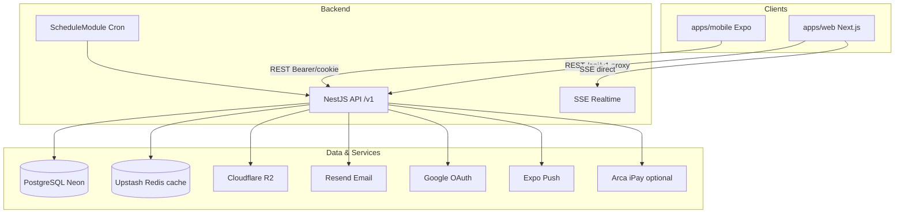

# Ommm — Պրոյեկտի ամբողջական նկարագրություն և անալիզ

**Ամսաթիվ:** 2026-06-11  
**Repo:** `ommm` monorepo (Size C)  
**Տեսակ:** wellness / studio (yoga, pilates, reformer) full-stack պլատֆորմ

---

## Executive summary

**Ommm**-ը studio-ի բիզնեսը մի տեղում լուծող production-oriented պլատֆորմ է՝ հանրային marketing կայք, member հավելված, staff backoffice (admin / manager / coach / content admin) և mobile app (Expo)։ Բոլոր շերտերը աշխատում են NestJS REST API + Prisma/PostgreSQL ընդհանուր domain model-ի վրա։

**Ինչ է լուծում.**

- Studio brand-ի հանրային ներկայացում (home, story, coaches, schedule, packages, explore/blog)
- Դասերի schedule, booking, waitlist ավտոմատացում
- Membership / package վաճառք և կառավարում
- Drop-in և gift card վճարումներ (manual confirmation + optional Arca gateway)
- Role-based CRM, finance, analytics, notifications
- Բազմալեզու UI (`hy` | `ru` | `en`) և SSE realtime invalidation

---

## 1. Նախագծի նպատակ և scope

| Շերտ | Նշանակություն |
|------|---------------|
| **Հանրային կայք** | Studio brand, schedule, coaches, packages, explore/blog, contact |
| **Member (USER)** | Class booking, waitlist, memberships, payments, gift cards, progress |
| **Coach** | Իմ դասեր, roster/attendance, աշխատավարձ, analytics |
| **Manager** | Օպերացիոն կառավարում (սահմանափակ admin-ի համեմատ) |
| **Content Admin** | Explore/blog կոնտենտի workflow |
| **Admin** | Լիակատար studio backoffice — CRM, finance, analytics, settings |

---

## 2. Monorepo կառուցվածք

```
ommm/
├── apps/
│   ├── web/          # Next.js 16 App Router — marketing + dashboards
│   ├── api/          # NestJS 11 REST API (/v1)
│   └── mobile/       # Expo 54 (expo-router)
├── packages/
│   └── database/     # Prisma schema, migrations, seed, client
├── docs/             # Architecture, design, deploy, analysis
├── .env.example      # Shared env contract (root)
└── pnpm-workspace.yaml
```

**Package manager:** `pnpm workspaces`  
**Node:** `>=20`

### Dev commands

```bash
pnpm install              # postinstall → prisma generate
pnpm run dev              # web + api (dev:stack)
pnpm run dev:web          # Next.js only
pnpm run dev:api          # NestJS only
pnpm run dev:all          # web + api + mobile
pnpm run build:api        # database build + Nest build
pnpm run test             # API Jest tests
pnpm run test:e2e:web     # Playwright e2e
```

---

## 3. System architecture



| Շերտ | Տեխնոլոգիա |
|------|------------|
| Web | Next.js 16 App Router, React 19, Tailwind CSS 4, next-intl |
| API | NestJS 11, Passport JWT, class-validator, pino, helmet, throttler |
| Mobile | Expo 54, expo-router |
| DB | PostgreSQL (Neon-compatible), Prisma 6 |
| Auth | JWT httpOnly cookie + Bearer, Google OAuth, argon2 passwords |
| Email | Resend (`log` fallback dev-ում) |
| Storage | Cloudflare R2 (+ local disk fallback uploads) |
| Cache | Upstash Redis (public marketing reads TTL cache) |
| Push | Expo Push API (`PushDeviceToken` table) |
| Realtime | SSE thin invalidation (schedule, session, cancel-intent) |
| Payments | Manual admin confirmation + optional Arca iPay redirect |
| Testing | Jest (API), Playwright (web e2e) |

**API prefix:** `/v1` (Nest) — web server-side proxy `/api/v1`; browser SSE-ը ուղղակի `NEXT_PUBLIC_API_ORIGIN`-ին է միանում։

---

## 4. Դերեր և RBAC

### 4.1. Prisma `Role` enum

| Role | Նկարագրություն |
|------|---------------|
| `USER` | Member / client |
| `COACH` | Instructor |
| `MANAGER` | Operations manager |
| `CONTENT_ADMIN` | Content editor |
| `ADMIN` | Full platform admin |

### 4.2. Post-auth home paths

**Ֆայլ:** `apps/web/src/lib/role-home.ts`

| Role | Home path |
|------|-----------|
| `USER` | `/user` |
| `COACH` | `/coach/home` |
| `MANAGER` | `/manager/home` |
| `CONTENT_ADMIN` | `/content-admin/home` |
| `ADMIN` | `/admin/dashboard` |

### 4.3. Auth guard (web)

**Ֆայլ:** `apps/web/src/server/require-role-layout.ts`

1. `GET /users/me` — session validation (JWT cookie)
2. Unauthenticated → `/{locale}/login`
3. Wrong role → role home redirect
4. User profile `locale` ≠ URL locale → redirect preferred locale-ում

### 4.4. API guards

- `JwtAuthGuard` — JWT validation
- `RolesGuard` — role-based endpoint access
- **Ֆայլեր:** `apps/api/src/common/guards/`

---

## 5. Web routing մոդել

### 5.1. URL կառուցվածք

```
/                    → redirect → /en (default locale)
/{locale}/...        → բոլոր էջերը
```

**Locales:** `hy` | `ru` | `en` (default: `en`)  
**Ֆայլ:** `apps/web/src/i18n/routing.ts` — `localePrefix: "always"`

### 5.2. Route groups (URL-ում չեն երևում)

| Group | Path prefix | Layout | Auth |
|-------|-------------|--------|------|
| `(marketing)` | `/`, `/story`, `/schedule`, … | Marketing shell | Public |
| `(auth)` | `/login`, `/register`, … | Auth layout | Public |
| `(account)` | `/user/*`, `/account`, `/dashboard` | Member shell | USER |
| `(admin)` | `/admin/*` | DashboardAppShell | ADMIN |
| `(coach)` | `/coach/*` | DashboardAppShell | COACH |
| `(manager)` | `/manager/*` | DashboardAppShell | MANAGER |
| `(content-admin)` | `/content-admin/*` | DashboardAppShell | CONTENT_ADMIN |
| Standalone | `/verify-email`, `/set-password` | Locale layout | Mixed |

### 5.3. Middleware

**Ֆայլ:** `apps/web/middleware.ts`

- next-intl locale routing
- UI locale cookie sync
- Account shell paths-ում cookie redirect skip

### 5.4. Parallel routes (member mobile drawer)

Member shell-ում `@sheet` parallel route-ներ intercept են անում navigation-ը mobile-style bottom sheet-ով.

| Intercept path | Full page |
|----------------|-----------|
| `@sheet/(.)bookings` | `/user/bookings` |
| `@sheet/(.)classes` | `/user/classes` |
| `@sheet/(.)packages` | `/user/packages` |
| `@sheet/(.)payments` | `/user/payments` |
| `@sheet/(.)gift-cards` | `/user/gift-cards` |
| `@sheet/(.)waitlists` | `/user/waitlists` |
| `@sheet/(.)profile` | `/user/profile` |
| `@sheet/(.)notifications` | `/user/notifications` |

---

## 6. Բոլոր web էջերը

> Բոլոր path-երը **առանց locale prefix** — իրական URL: `/{locale}{path}`  
> Օրինակ: `/user/bookings` → `/hy/user/bookings`

### 6.1. Root

| Path | Ֆունկցիա | Տիպ |
|------|----------|-----|
| `/` (app root) | Redirect → default locale | Redirect |

### 6.2. Standalone `[locale]`

| Path | Auth | Ֆունկցիա |
|------|------|----------|
| `/verify-email` | No | Email verification (`POST /auth/verify-email`) |
| `/set-password` | Yes | Առաջին անգամ password setup (OAuth users) |

### 6.3. Marketing — հանրային

| Path | Ֆունկցիա | Տիպ |
|------|----------|-----|
| `/` | Home: hero, classes, coaches, plans, gallery, public schedule | Էջ |
| `/story` | Studio story (static i18n, ISR) | Էջ |
| `/schedule` | Public class schedule + booking CTA | Էջ |
| `/packages` | Membership/package plans browser | Էջ |
| `/packages/[categoryKey]` | Redirect → `/packages?category=` | Redirect |
| `/coaches` | Public coaches directory | Էջ |
| `/explore` | Blog/explore posts list | Էջ |
| `/explore/[slug]` | Single explore post detail | Էջ |
| `/contact` | Contact form → `POST /contact` | Էջ |
| `/membership` | Redirect → `/schedule` | Redirect |
| `/memberships` | Redirect → `/schedule` | Redirect |

**Marketing header nav** (`marketing-nav-links.ts`): Home, Story, Schedule, Packages, Coaches, Explore, Contact

### 6.4. Auth — հանրային

| Path | Ֆունկցիա |
|------|----------|
| `/login` | Email/password login, Google OAuth, role-based redirect |
| `/register` | Registration + validation, Google OAuth |
| `/forgot-password` | Password reset request email |
| `/reset-password` | Password reset with token |
| `/account` | OAuth return hub; authed → role home, else sign-in CTA |

### 6.5. Member account (USER)

| Path | Ֆունկցիա | API / Features |
|------|----------|----------------|
| `/dashboard` | Redirect → `/user` | — |
| `/user` | Member dashboard hub | `/users/me`, bookings, waitlist |
| `/user/dashboard` | Dashboard widgets, upcoming bookings | `/bookings/me`, `/waitlist/me` |
| `/user/bookings` | Upcoming/past bookings + waitlist | Cancel/rebook |
| `/user/waitlists` | Waitlist entries management | `/waitlist/me` |
| `/user/classes` | Bookable sessions | Book / join waitlist |
| `/user/packages` | My memberships | `/packages/me` |
| `/user/packages/[categoryKey]` | Package category detail | Public plans API |
| `/user/payments` | Payment history | `/payments/me` |
| `/user/payments/checkout` | Payment checkout flow | Arca redirect or fake pay |
| `/user/payments/success` | Payment success landing | — |
| `/user/payments/fail` | Payment failure landing | — |
| `/user/gift-cards` | Redeem, purchase, purchased/received | Gift card API |
| `/user/gift-cards/payment-result` | Gift card payment result | — |
| `/user/gift-cards/fake-payment` | Dev/test fake payment flow | Query params (dev only) |
| `/user/notifications` | Notification preferences | `PATCH /users/me/notifications` |
| `/user/profile` | Profile settings, avatar, password | `/users/me` PATCH |
| `/user/progress` | Achievements, member analytics | `/reports/user/analytics` |
| `/user/settings` | Redirect → `/user/profile` | Redirect |

**Member sidebar** (`dashboard-nav.ts`): Dashboard, Bookings, Waitlists, Schedule, Packages, Payments, Gift Cards, Profile

### 6.6. Admin (ADMIN)

| Path | Ֆունկցիա | Տիպ |
|------|----------|-----|
| `/admin` | Redirect → `/admin/dashboard` | Redirect |
| `/admin/home` | Redirect → `/admin/dashboard` | Redirect |
| `/admin/dashboard` | KPI metrics dashboard | Էջ |
| `/admin/bookings` | Full bookings management (list, move, attendance, notes) | Էջ |
| `/admin/waitlists` | Waitlist management (promote, notify, remove) | Էջ |
| `/admin/clients` | Client CRM, notes, filters, block | Էջ |
| `/admin/coaches` | Coach directory, schedule, CRUD | Էջ |
| `/admin/schedule` | Session CRUD, calendar views, recurrence | Էջ |
| `/admin/packages` | Package plan management | Էջ |
| `/admin/gift-cards` | Gift card batches, assign, deactivate | Էջ |
| `/admin/finance` | Redirect → `/admin/finance/overview` | Redirect |
| `/admin/finance/overview` | Revenue overview, finance KPIs | Էջ |
| `/admin/finance/payments` | Payment list, status confirmation | Էջ |
| `/admin/finance/members` | Member billing / package revenue | Էջ |
| `/admin/finance/coaches` | Coach salary summaries | Էջ |
| `/admin/analytics` | Redirect → `/admin/analytics/overview` | Redirect |
| `/admin/analytics/overview` | Studio analytics overview | Էջ |
| `/admin/analytics/revenue` | Revenue analytics | Էջ |
| `/admin/analytics/bookings` | Booking analytics | Էջ |
| `/admin/analytics/members` | Member analytics | Էջ |
| `/admin/analytics/coaches` | Coach performance analytics | Էջ |
| `/admin/notifications` | Broadcast, scheduled, delivery stats | Էջ |
| `/admin/content` | Explore/content posts panel (review workflow) | Էջ |
| `/admin/settings` | Studio settings | `/studio` GET/PATCH |
| `/admin/profile` | Admin profile | Էջ |
| `/admin/feedback` | Redirect → `/admin/content` | Redirect |
| `/admin/guest-users` | Redirect → `/admin/clients` | Redirect |
| `/admin/reports` | Redirect → `/admin/analytics` | Redirect |
| `/admin/memberships` | Redirect → `/admin/packages` | Redirect |

**Admin sidebar:** Dashboard, Bookings, Waitlists, Clients, Coaches, Schedule, Packages, Gift Cards, Finance, Analytics, Notifications, Content, Settings, Guest Users

### 6.7. Coach (COACH)

| Path | Ֆունկցիա | Տիպ |
|------|----------|-----|
| `/coach` | Redirect → `/coach/home` | Redirect |
| `/coach/home` | Today's sessions / roster summary | Էջ |
| `/coach/schedule` | Upcoming sessions | Էջ |
| `/coach/groups` | Attendance roster | Էջ |
| `/coach/salary` | Earnings summary | `/coaches/panel/salary` |
| `/coach/analytics` | 30-day analytics | `/reports/coach/analytics` |
| `/coach/profile` | Coach profile | Էջ |
| `/coach/notifications` | Notification preferences | Էջ |
| `/coach/settings` | Redirect → `/coach/profile` | Redirect |

**Coach sidebar:** Dashboard, Schedule, Groups, Salary, Analytics, Profile

### 6.8. Manager (MANAGER)

| Path | Ֆունկցիա | Մակարդակ |
|------|----------|----------|
| `/manager/home` | Ops overview KPIs | `/reports/dashboard` |
| `/manager/classes` | View class types + sessions | Partial (view-only) |
| `/manager/bookings` | Bookings table, limited actions | Partial |
| `/manager/waitlists` | Waitlist table, move/remove | Partial |
| `/manager/clients` | Client list + limited actions | Partial |
| `/manager/coaches` | Coach directory (no delete) | Partial |
| `/manager/gift-cards` | View cards (no create/deactivate) | Partial |
| `/manager/profile` | Manager profile | Full |
| `/manager/settings` | Redirect → `/manager/profile` | Redirect |

**Manager sidebar:** Home, Schedule, Bookings, Waitlists, Clients, Coaches, Gift Cards, Profile

### 6.9. Content Admin (CONTENT_ADMIN)

| Path | Ֆունկցիա |
|------|----------|
| `/content-admin/home` | Hub links |
| `/content-admin/content` | ContentPostsPanel — explore posts CRUD + review |
| `/content-admin/profile` | Profile |
| `/content-admin/notifications` | Notification preferences |

### 6.10. Next.js API routes (web)

| Path | Ֆունկցիա |
|------|----------|
| `/api/cron/warm-api` | Vercel cron — API warm-up |

---

## 7. Էջերի վիճակագրություն

| Խումբ | Route files | Redirects | Լիարժեք էջեր |
|-------|-------------|-----------|---------------|
| Root | 1 | 1 | 0 |
| Standalone locale | 2 | 0 | 2 |
| Marketing | 11 | 3 | 8 |
| Auth | 5 | 0 | 5 |
| Account (USER) | 22 (+8 @sheet intercept) | 2 | ~18 |
| Admin | 28 | 7 | 21 |
| Coach | 9 | 2 | 7 |
| Manager | 9 | 1 | 8 |
| Content-admin | 4 | 0 | 4 |
| **Ընդամենը** | **97 page.tsx** | **~16** | **~75** |

---

## 8. Backend API — ամբողջական map

**Base prefix:** `/v1`  
**~110 HTTP endpoints**, 18 controllers, 22 registered modules

### 8.1. NestJS modules

`auth`, `users`, `studio`, `contact`, `coaches`, `classes`, `bookings`, `waitlist`, `schedule`, `packages`, `payments`, `gift-cards`, `content`, `clients`, `notifications`, `reports`, `realtime`, `cache`, `audit`, `mail`, `prisma`

### 8.2. Health

| Method | Path | Roles |
|--------|------|-------|
| GET | `/health` | Public |

### 8.3. Auth (`/auth`)

| Method | Path | Նկարագրություն | Roles |
|--------|------|---------------|-------|
| POST | `/register` | Registration + JWT cookie | Public |
| POST | `/login` | Login + JWT cookie | Public |
| GET | `/google` | Google OAuth start | Public |
| GET | `/google/callback` | OAuth callback + cookie | Public |
| POST | `/logout` | Clear cookie | Public |
| POST | `/verify-email` | Email verification | Public |
| POST | `/request-password-reset` | Reset email | Public |
| POST | `/reset-password` | New password | Public |
| POST | `/session` | Current user from JWT | Authenticated |

### 8.4. Users (`/users`)

| Method | Path | Նկարագրություն | Roles |
|--------|------|---------------|-------|
| GET | `/me` | Current user profile | Authenticated |
| PATCH | `/me` | Update profile + refresh JWT | Authenticated |
| PATCH | `/me/password` | Change password | Authenticated |
| POST | `/me/home-image`, `/me/home-image-json` | Home image upload | Authenticated |
| PATCH | `/me/notifications` | Notification preferences | Authenticated |
| POST | `/me/push-token` | Register push token | Authenticated |
| DELETE | `/me` | Delete account | Authenticated |
| POST | `/me/delete-request` | Request account deletion | Authenticated |

### 8.5. Realtime SSE (`/realtime`)

| Method | Path | Նկարագրություն | Roles |
|--------|------|---------------|-------|
| GET | `/public` | Guest stream — schedule/session/cancel-intent invalidation | Public |
| GET | `/events` | Auth stream — public + user-scoped private events | Authenticated |

**Client behavior:** event → debounced REST refetch; 60s poll fallback schedule surfaces-ում SSE disconnect-ի դեպքում.

### 8.6. Studio (`/studio`)

| Method | Path | Roles |
|--------|------|-------|
| GET | `/` | Public |
| PATCH | `/` | ADMIN |

### 8.7. Contact (`/contact`)

| Method | Path | Roles |
|--------|------|-------|
| POST | `/` | Public |

### 8.8. Coaches (`/coaches`)

| Method | Path | Roles |
|--------|------|-------|
| GET | `/` | Public |
| GET | `/:id` | Public |
| GET | `/panel/summary` | COACH |
| GET | `/panel/salary` | COACH |
| GET | `/admin/list` | ADMIN, MANAGER |
| GET | `/admin/salary-summaries` | ADMIN, MANAGER |
| POST | `/` | ADMIN |
| PATCH | `/:id` | ADMIN |
| DELETE | `/:id` | ADMIN |
| POST | `/:id/photo-json` | ADMIN |

### 8.9. Classes (`/classes`)

| Method | Path | Roles |
|--------|------|-------|
| GET | `/types` | Public |
| POST/PATCH | `/types`, `/types/:id` | ADMIN, MANAGER (delete: ADMIN only) |
| DELETE | `/types/:id` | ADMIN |
| GET | `/sessions`, `/sessions/:id` | Public |
| GET | `/admin/sessions` | ADMIN |
| POST | `/sessions`, `/sessions/batch` | ADMIN |
| PATCH | `/sessions/:id` | ADMIN |
| POST | `/sessions/:id/cancel`, `/status` | ADMIN |
| DELETE | `/sessions/:id` | ADMIN |

### 8.10. Bookings (`/bookings`)

| Method | Path | Roles |
|--------|------|-------|
| POST | `/sessions/:sessionId` | Authenticated |
| GET | `/me` | Authenticated |
| DELETE | `/:id` | Authenticated (own) |
| GET | `/admin`, `/admin/management`, `/admin/:id` | ADMIN, MANAGER, COACH |
| PATCH | `/admin/:id`, `/admin/:id/move`, `/admin/:id/attendance` | ADMIN, MANAGER, COACH |
| DELETE | `/admin/:id` | ADMIN, MANAGER |
| DELETE | `/admin/:id/permanent` | ADMIN |
| POST | `/:id/notes` | ADMIN, MANAGER, COACH |

### 8.11. Waitlist (`/waitlist`)

| Method | Path | Roles |
|--------|------|-------|
| POST/DELETE | `/sessions/:sessionId` | Authenticated |
| GET | `/me` | Authenticated |
| GET | `/admin/recent`, `/admin/active` | ADMIN, MANAGER |
| GET | `/sessions/:sessionId` | ADMIN, MANAGER, COACH |
| DELETE | `/entries/:id` | ADMIN, MANAGER |
| POST | `/entries/:id/promote`, `/notify` | ADMIN, MANAGER |

### 8.12. Schedule (`/schedule`)

| Method | Path | Roles |
|--------|------|-------|
| GET | `/public` | Public |
| GET/POST/PATCH/DELETE | `/admin/*` | ADMIN |

### 8.13. Packages (`/packages`)

| Method | Path | Roles |
|--------|------|-------|
| GET | `/plans` | Public |
| GET | `/me` | Authenticated |
| POST | `/me/subscribe` | Authenticated |
| PATCH | `/me/:id/pause`, `/cancel`, `/renew`, `/change-plan` | Authenticated |
| GET/POST/PATCH/DELETE | `/plans`, `/admin/*` | ADMIN |
| POST | `/admin/assign` | ADMIN |
| PATCH | `/admin/:id/status` | ADMIN |

### 8.14. Payments (`/payments`)

| Method | Path | Roles |
|--------|------|-------|
| POST | `/checkout/gift` | Authenticated |
| POST | `/checkout/gift/:reference/confirm` | Authenticated |
| POST | `/checkout/dropin/:sessionId` | Authenticated |
| GET | `/me` | Authenticated |
| GET | `/admin` | ADMIN, MANAGER |
| PATCH | `/admin/:paymentId/status` | ADMIN, MANAGER |

### 8.15. Arca payments (`/payments/arca`)

| Method | Path | Roles |
|--------|------|-------|
| POST | `/init` | Authenticated — bank redirect init |
| GET | `/callback` | Public — bank return, redirect to web success/fail |

**Env:** `ARCA_CHECKOUT_ENABLED=false` (default) → in-app fake pay; `true` → redirect to Arca bank page.

### 8.16. Gift cards (`/gift-cards`)

| Method | Path | Roles |
|--------|------|-------|
| GET | `/me/purchased`, `/me/received` | Authenticated |
| POST | `/redeem` | Authenticated |
| GET | `/market` | Authenticated |
| GET/POST/PATCH/DELETE | `/admin/*` | ADMIN (create/delete: ADMIN; view: MANAGER) |
| POST | `/admin/:id/resend`, `/admin/batches/:id/resend` | ADMIN, MANAGER |

### 8.17. Content (`/content`)

| Method | Path | Roles |
|--------|------|-------|
| GET | `/posts`, `/posts/:slug` | Public |
| GET/POST/PATCH/DELETE | `/admin/posts/*` | ADMIN, CONTENT_ADMIN |
| POST | `/admin/posts/:id/submit-review`, `/review` | ADMIN, CONTENT_ADMIN |
| POST | `/admin/cover-image` | ADMIN, CONTENT_ADMIN |

### 8.18. Clients (`/clients`)

| Method | Path | Roles |
|--------|------|-------|
| GET | `/`, `/:id` | ADMIN, MANAGER |
| PATCH | `/:id` | ADMIN, MANAGER |
| DELETE | `/:id` | ADMIN |
| POST | `/:id/notes` | ADMIN, MANAGER |
| GET | `/:id/bookings`, `/:id/payments`, `/:id/gift-cards` | ADMIN, MANAGER |

### 8.19. Notifications (`/notifications`)

| Method | Path | Roles |
|--------|------|-------|
| POST | `/admin/broadcast` | ADMIN |
| GET | `/admin/stats`, `/deliveries`, `/analytics`, `/scheduled` | ADMIN |
| PATCH/DELETE | `/admin/scheduled/:id` | ADMIN |

### 8.20. Reports (`/reports`)

| Method | Path | Roles |
|--------|------|-------|
| GET | `/dashboard` | ADMIN, MANAGER |
| GET | `/finance/summary` | ADMIN, MANAGER |
| GET | `/bookings.csv`, `/payments.csv`, `/gift-credits.csv` | ADMIN |
| GET | `/coach/analytics` | COACH |
| GET | `/user/analytics` | USER |

---

## 9. Background jobs (Cron)

| Service | Interval | Ֆունկցիա |
|---------|----------|----------|
| `NotificationsService` | 30 min | Class reminder emails + push (BOOKED sessions, configurable env) |
| `NotificationsService` | 10 min | Scheduled broadcast dispatch |
| `WaitlistService` | 10 min | Expire stale waitlist offers + auto-promote next |

---

## 10. Database — domain model

**Schema:** `packages/database/prisma/schema.prisma`

### 10.1. Key enums

`Role`, `ClassSessionStatus`, `BookingStatus`, `BookingChannel`, `WaitlistStatus`, `ContentType`, `ContentStatus`, `PaymentStatus`, `PaymentSource`, `PackageStatus`, `ManualPaymentMethod`, `GiftCardStatus`, `AuthTokenType`, `ScheduleDayOfWeek`, `SessionRecurrencePattern`

### 10.2. Models

| Model | Նշանակություն |
|-------|---------------|
| `User` | Users, roles, locale, gift credits, block status |
| `AuthToken` | Email verify, password reset tokens |
| `OAuthAccount` | Google OAuth linkage |
| `PushDeviceToken` | Mobile push tokens |
| `CoachProfile` | Coach bio, specialization, class types |
| `CoachAvailabilitySlot` | Coach availability slots |
| `ClassType` | Yoga, Pilates, Reformer, etc. |
| `ClassSession` | Scheduled classes (recurrence support) |
| `Booking` | Member bookings + attendance |
| `BookingNote` | Staff notes on bookings |
| `WaitlistEntry` | Waitlist with offer/promote flow |
| `PackagePlan` | Membership plans catalog |
| `UserPackage` | User subscriptions (ACTIVE/PAUSED/CANCELLED/PENDING) |
| `Payment` | Manual + Arca payments (PACKAGE/DROPIN/GIFT) |
| `GiftCard`, `GiftCardBatch` | Gift cards lifecycle |
| `ContentPost`, `ContentPostTranslation` | Explore/blog (multilingual) |
| `ContactMessage` | Contact form submissions |
| `StudioSettings` | Studio config (cancellation hours, waitlist offer minutes) |
| `ScheduleItem` | Public weekly schedule templates |
| `Achievement`, `UserAchievement` | Member progress gamification |
| `NotificationPreference` | User notification settings |
| `ClientNote` | CRM notes on clients |
| `ClassReminderSendLog` | Reminder deduplication |
| `AuditLog` | Audit trail |

### 10.3. Entity relationships (high-level)

```
User ─┬─ bookings, waitlist, payments, userPackages, giftCards
      ├─ coachProfile → ClassSession (coach / substitute)
      ├─ notificationPrefs, pushDeviceTokens, oauthAccounts
      └─ achievements (UserAchievement)

ClassSession ─┬─ ClassType
              ├─ Booking, WaitlistEntry
              └─ recurrence (pattern, weekdays, endsAt)

UserPackage ── PackagePlan
Payment ── UserPackage (optional), PackagePlan (optional)
GiftCard ── GiftCardBatch (optional)
ContentPost ── ContentPostTranslation (per locale)
```

---

## 11. Հիմնական բիզնես հոսքեր

### 11.1. Visitor → Member

1. Visitor մտնում է marketing pages
2. `login` / `register` (email կամ Google OAuth)
3. JWT session cookie
4. USER → `/user`; staff → respective home

### 11.2. Booking

1. Member բացում է `/user/classes` կամ public `/schedule`
2. `POST /bookings/sessions/:sessionId`
3. Capacity check → booking `BOOKED`
4. Session full → waitlist offer
5. SSE `session.changed` → client refetch schedule/bookings

### 11.3. Waitlist

1. `POST /waitlist/sessions/:sessionId` — join
2. Spot opens → auto-offer email (configurable minutes via `StudioSettings.waitlistOfferMinutes`)
3. Cron expires stale offers → promote next
4. Admin manual promote/notify
5. Convert to booking կամ `EXPIRED`/`REMOVED`

### 11.4. Package / Payment

1. User ընտրում է plan / drop-in / gift card
2. API creates `PENDING` payment
3. Checkout: fake pay (default) կամ Arca redirect (`ARCA_CHECKOUT_ENABLED=true`)
4. Admin/Manager confirms manual payments (`PATCH /payments/admin/:id/status`)
5. Side-effects: package activation, gift card issue, booking unlock

### 11.5. Content workflow

1. Content admin ստեղծում է `DRAFT` post
2. `submit-review` → `IN_REVIEW`
3. Review decision → `PUBLISHED` / `REJECTED`
4. Public `/explore` ցուցադրում (per-locale translations)

### 11.6. Gift cards

1. Purchase via checkout → pending payment
2. Admin confirms → batch/card issued
3. Redeem code → `giftCreditsCents` balance
4. Assign recipient, resend email, deactivate

---

## 12. Mobile app (Expo)

**Path:** `apps/mobile/app/` — նույն `/v1` API contract

| Screen | Route | Role |
|--------|-------|------|
| Index | `/` | — |
| Welcome | `/(auth)/welcome` | Public |
| Login | `/(auth)/login` | Public |
| Register | `/(auth)/register` | Public |
| Home | `/(main)/home` | Public/mixed |
| Schedule | `/(main)/schedule` | Public |
| Plans | `/(main)/plans` | Public |
| Classes | `/(main)/classes` | Public |
| User home | `/(main)/user/home` | USER |
| User classes | `/(main)/user/classes` | USER |
| User schedule | `/(main)/user/schedule` | USER |
| User plans | `/(main)/user/plans` | USER |
| User progress | `/(main)/user/progress` | USER |
| User profile | `/(main)/user/profile/*` | USER |
| Coach home | `/(main)/coach/home` | COACH |
| Coach profile | `/(main)/coach/profile` | COACH |
| Manager home | `/(main)/manager/home` | MANAGER |
| Manager bookings | `/(main)/manager/bookings` | MANAGER |
| Manager clients | `/(main)/manager/clients` | MANAGER |
| Manager profile | `/(main)/manager/profile` | MANAGER |
| Admin home | `/(main)/admin/home` | ADMIN |
| Admin clients | `/(main)/admin/clients` | ADMIN |
| Admin profile | `/(main)/admin/profile` | ADMIN |

Mobile scope-ը **փոքր է** web-ի համեմատ — հիմնական member + limited staff screens. Push token registration՝ `POST /users/me/push-token`.

---

## 13. i18n

- **Locales:** `hy`, `ru`, `en`
- **Messages:** `apps/web/src/messages/{hy,ru,en}.json`
- **Marketing:** URL locale prefix (`localePrefix: "always"`)
- **Dashboards:** User profile `locale` field overrides URL (account shell)
- **Language switcher:** Cookie + `PATCH /users/me` locale update
- **Content:** `ContentPostTranslation` — per-locale slugs/titles/body

---

## 14. Ինտեգրացիաներ

| Service | Status | Նշանակություն |
|---------|--------|---------------|
| Google OAuth | ✅ Live | Social login + account linking |
| Resend | ✅ | Transactional email (verify, reset, reminders, broadcasts) |
| Cloudflare R2 | ✅ | Avatar, coach photos, content covers, gift card images |
| Expo Push | ✅ | Mobile push notifications |
| Upstash Redis | ✅ Optional | Public API response cache (schedule, coaches, plans, content) |
| Arca iPay | ⚙️ Partial | `POST /payments/arca/init` + callback; default off (`ARCA_CHECKOUT_ENABLED=false`) |
| Payment gateways (docs) | 📋 Reference only | TelCell, Idram, FastShift, AmeriaBank — `docs/reference/payment integration/` |

---

## 15. UI architecture (web)

| Shell | Component | Օգտագործում |
|-------|-----------|-------------|
| Marketing | `MarketingLayoutShell`, `MarketingSiteHeader` | Public pages |
| Dashboard | `DashboardAppShell` | All role panels |
| Auth | `(auth)/layout.tsx` | Login/register |
| Member mobile | `@sheet` parallel routes | Bottom sheet navigation |

**Key libs:**

| File | Նշանակություն |
|------|---------------|
| `lib/api.ts` | Client-side API fetch |
| `lib/server-api.ts` | Server Components API fetch |
| `lib/dashboard-nav.ts` | Sidebar navigation per role |
| `lib/role-home.ts` | Role home paths |
| `lib/realtime/*` | SSE connection + refetch registry |
| `middleware.ts` | Locale + cookie routing |

**Design guide:** `docs/PROJECT_DESIGN_GUIDE.md` — visual tokens, responsive rules, page structure.

---

## 16. Deployment

| Component | Platform | Docs |
|-----------|----------|------|
| Web | Vercel | `docs/VERCEL_ENV.md`, `docs/DEPLOY_ENV_PLACEMENT.md` |
| API | Render (documented) | `docs/DEPLOY_ENV_PLACEMENT.md` |
| DB | Neon PostgreSQL | `.env.example` DATABASE_URL / DIRECT_URL |
| Cron warm | Vercel → `/v1/health` | `CRON_SECRET` |

---

## 17. Testing

| Layer | Tool | Command |
|-------|------|---------|
| API unit/integration | Jest | `pnpm run test` |
| Web e2e | Playwright | `pnpm run test:e2e:web` |
| Seed data | Prisma seed | `packages/database/prisma/seed.ts` — demo users per role |

---

## 18. Coverage matrix — ունենք vs չունենք

> **Legend:** ✅ Ամբողջական · ⚙️ Մասնակի / baseline · ❌ Չկա · 📋 Միայն docs / reference

| Ֆունկցիոնալ | Վիճակ | Նշում |
|-------------|-------|-------|
| **Monorepo + DB + Prisma migrations** | ✅ | `packages/database` |
| **Auth (email/password, JWT, Google OAuth)** | ✅ | verify, reset, set-password |
| **RBAC 5 roles (web + API guards)** | ✅ | Manager scope intentionally narrower |
| **Marketing home, story, schedule, coaches, packages, contact** | ✅ | Story mostly static i18n |
| **Public `/explore` blog list** | ❌ | UI-ում «Coming soon» placeholder; CMS/API-ն արդեն կա |
| **Explore post detail `/explore/[slug]`** | ⚙️ | Route կա, բայց index-ը չի ցուցադրում posts |
| **Member booking + cancel + waitlist** | ✅ | SSE invalidation + email |
| **Package subscribe / pause / cancel / renew / change-plan** | ✅ | Manual payment confirmation |
| **Drop-in checkout** | ✅ | Internal PENDING payment |
| **Gift cards purchase / redeem / admin** | ✅ | Batch support |
| **Admin CRM (clients, bookings, schedule, coaches)** | ✅ | Table views; full calendar optional |
| **Admin finance + analytics + CSV export** | ⚙️ | KPI/charts depth limited vs full BI |
| **Admin notifications (broadcast, scheduled, stats)** | ⚙️ | Email v1; no SMS; template depth partial |
| **Content CMS + review workflow** | ✅ | Admin/content-admin panels |
| **Coach panel (schedule, groups, salary, analytics)** | ⚙️ | Salary uses hardcoded formula (see §19) |
| **Manager panel** | ⚙️ | View-only / partial write vs Admin |
| **Member progress / achievements** | ⚙️ | Page exists; engine shallow; no sidebar link |
| **Manual / offline payments (admin confirm)** | ✅ | Primary payment model |
| **Arca iPay card checkout** | ⚙️ | Code exists; default off (`ARCA_CHECKOUT_ENABLED=false`) |
| **TelCell / Idram / FastShift / AmeriaBank** | 📋 | Integration docs only |
| **Stripe / YooKassa** | ❌ | Not in codebase |
| **EHDM fiscal receipts** | 📋 | Reference docs only |
| **Automatic refund on cancel** | ❌ | Policy enforced; money refund automation չկա |
| **Recurring session generator (admin UI)** | ⚙️ | Schema + DTO fields; batch UX incomplete |
| **Admin calendar (month/week/day views)** | ❌ | Table/list views only |
| **Global dashboard search** | ❌ | UI shell + «not available yet» hint |
| **Member in-app notification inbox** | ❌ | Prefs only (`/user/notifications`); no message feed |
| **Web push notifications** | ❌ | Email + Expo push only |
| **SMS notifications** | ❌ | — |
| **Apple / Facebook OAuth** | ❌ | Google only |
| **SSE realtime (single instance)** | ✅ | Public + auth channels |
| **SSE multi-instance (Redis pub/sub)** | ❌ | Planned in TECH_CARD |
| **Redis public cache** | ⚙️ | Optional; falls back to DB without env |
| **Mobile app (Expo) full parity** | ❌ | Baseline only; phase frozen per plan |
| **Mobile i18n (hy/ru/en)** | ❌ | English hardcoded in many screens |
| **Playwright e2e coverage** | ⚙️ | 2 specs (marketing home + SSE) |
| **CI workflow (GitHub Actions)** | ❌ | Dependabot only; no test/build CI |
| **PROGRESS.md / formal BRIEF** | ❌ | BRIEF template empty; no PROGRESS file |
| **docs/01-ARCHITECTURE.md** | ❌ | File missing |
| **Production deploy runbook (complete)** | ⚙️ | Docs exist; phase 13 checklist open |

---

## 19. Մանրամասն — ինչ **չունենք** (բացակայող / անավարտ)

### 19.1. Հանրային կայք և marketing

| Բացակա | Մանրամաս |
|--------|----------|
| **Explore index live content** | `GET /content/posts` API-ն և admin CMS-ը աշխատում են, բայց `/explore` էջը դեռ ցույց է տալիս `MarketingExploreComingSoon` placeholder |
| **Story CMS** | `/story` — static i18n JSON, ոչ admin-managed content |
| **Membership landing richness** | `/membership`, `/memberships` redirect են `/schedule`-ին |
| **Public class detail page** | Dedicated `/classes/[id]` route optional; schedule-ից direct booking |
| **SEO beyond basics** | Explore list OG metadata partial; full content SEO pipeline when explore goes live |

### 19.2. Member (USER) zone

| Բացակա | Մանրամաս |
|--------|----------|
| **Global search** | Dashboard shell-ում search input կա, բայց `globalSearchHint` — «դեռ հասանելի չէ» |
| **Notification inbox** | Member-ը կարող է միայն prefs փոխել; push/email-ով ուղարկված campaign/message history UI չկա |
| **Progress sidebar link** | `/user/progress` implemented, sidebar-ում link չկա |
| **Full achievement engine** | `Achievement`/`UserAchievement` models + basic page; deep gamification/badges logic shallow |
| **Automated account deletion** | `POST /users/me/delete-request` — request pipeline; full automated GDPR-style purge workflow unclear |
| **Gift card fake payment route** | `/user/gift-cards/fake-payment` — dev/test only, production path Arca/manual |

### 19.3. Վճարումներ և finance

| Բացակա | Մանրամաս |
|--------|----------|
| **Live payment gateways (default)** | Primary flow = PENDING payment + admin/manager manual confirm |
| **Arca production-ready** | Init/callback endpoints; requires env + `ARCA_CHECKOUT_ENABLED=true`; not default |
| **TelCell, Idram, FastShift, AmeriaBank** | `docs/reference/payment integration/` — integration guides only |
| **Stripe / international cards** | Not implemented |
| **EHDM / fiscal receipt (Armenia)** | Documented, not wired |
| **Automatic refunds** | Cancel policy + session credit restore; automatic money refund to card/bank չկա |
| **Payment retry / dunning** | Failed payment retry flows limited |
| **Coach salary real payroll** | `salarySummary()` uses hardcoded `basePerSessionCents=3000`, `perAttendeeShareCents=1000`, 60/40 payout split — not configurable per coach |

### 19.4. Admin / Manager / Coach backoffice

| Բացակա | Մանրամաս |
|--------|----------|
| **Admin calendar views** | Month/week/day calendar — table views only (`WEB_IMPLEMENTATION_PLAN` unchecked) |
| **Recurring schedule UI** | DB supports `recurrencePattern`; admin batch/generator UX incomplete |
| **Full BI analytics** | Analytics pages exist; rich charting/export dashboards vs enterprise CRM depth |
| **Manager = Admin parity** | By design limited: no gift card create/deactivate, no coach delete, partial finance |
| **Manager RBAC audit** | Some finance/payment endpoints may still allow MANAGER beyond strict CRM matrix (needs audit) |
| **Content multi-step approver SLA** | Review workflow exists; explicit approver assignment + SLA tracking չկա |
| **Guest users separate module** | `/admin/guest-users` redirects → `/admin/clients` |

### 19.5. Notifications

| Բացակա | Մանրամաս |
|--------|----------|
| **SMS channel** | Email + Expo push only |
| **Web push (PWA)** | Not implemented |
| **Rich notification templates UI** | Broadcast + scheduled queue baseline; full template editor/variables partial |
| **User notification history (all roles)** | Admin sees delivery logs; members don't see inbox |

### 19.6. Mobile app (Expo)

> Web implementation plan-ով mobile phase **սառեցված է** մինչ web production-ready (.cursor `22-mobile-frozen`).

| Բացակա | Մանրամաս |
|--------|----------|
| **Full API-backed screens** | Home still uses `homeMock.ts` for parts; Figma remote asset URLs expire ~7 days |
| **Placeholder tabs** | `(main)/plans.tsx`, signed-out flows — `PlaceholderTabScreen` |
| **Wrong tab IA** | «My Bookings» tab → `/user/classes`; «Plans» tab → `/user/progress` (not plans/billing) |
| **No gift cards / payments / waitlist mobile** | Web has full flows; mobile missing |
| **Staff mobile parity** | Admin: home + clients + profile only; Coach: home + profile; Manager: partial |
| **Content admin on mobile** | No `/content-admin/*`; tabs fall back to admin routes |
| **Mobile i18n** | No `next-intl` equivalent; English labels in `roleTabs.ts` and screens |
| **Dedicated My Bookings screen** | No `/user/bookings` mobile route |

### 19.7. Auth և identity

| Բացակա | Մանրամաս |
|--------|----------|
| **Apple Sign In** | Not implemented |
| **Facebook / other OAuth** | Not implemented |
| **2FA / MFA** | Not implemented |
| **Phone OTP login** | `phone` field on User; OTP flow չկա |

### 19.8. Infrastructure, docs, quality

| Բացակա | Մանրամաս |
|--------|----------|
| **`docs/BRIEF.md`** | Empty template — no formal product spec filled |
| **`docs/01-ARCHITECTURE.md`** | Missing file |
| **`PROGRESS.md`** | Not in repo |
| **GitHub Actions CI** | No `.github/workflows/` — tests not automated in CI |
| **Broad e2e coverage** | Only `marketing-home.spec.ts`, `sse-realtime.spec.ts` |
| **Production deploy checklist** | `WEB_IMPLEMENTATION_PLAN` phase 13 — Vercel+API hosting item open |
| **Multi-instance SSE** | Single-node in-memory publisher; Redis pub/sub for scale — not done |

### 19.9. Integrations env-only (needs production config)

| Integration | Code | Production config |
|-------------|------|-------------------|
| Resend email | ✅ | Needs `MAIL_TRANSPORT=resend`, API key |
| Cloudflare R2 | ✅ | Needs bucket + keys; local fallback without |
| Google OAuth | ✅ | Needs client ID/secret per environment |
| Upstash Redis | ✅ optional | Without env → direct DB reads |
| Expo Push | ✅ | Optional `EXPO_ACCESS_TOKEN` |
| Arca iPay | ⚙️ | Off by default |

---

## 20. Technical risks / tech debt

| ID | Risk | Severity | Նշում |
|----|------|----------|-------|
| R-1 | Booking ↔ payment race conditions | Medium | Drop-in checkout vs concurrent booking |
| R-2 | Waitlist cron env dependency | Medium | Periodic cleanup may depend on cron running |
| R-3 | Manager finance scope vs CRM matrix | Medium | Endpoint-level RBAC audit recommended |
| R-4 | Coach salary hardcoded rates | Medium | Misleading finance data until configurable |
| R-5 | Explore CMS built but public page hidden | Low | Content team can't use public explore yet |
| R-6 | Mobile IA confusion | High | Wrong tab labels/paths for members |
| R-7 | No CI gate | Medium | Regressions possible without automated pipeline |
| R-8 | Figma remote assets on mobile | Low | URLs expire; need local asset export |

---

## 21. Հիմնական source files

| Topic | Path |
|-------|------|
| All web pages | `apps/web/src/app/` |
| Middleware | `apps/web/middleware.ts` |
| i18n routing | `apps/web/src/i18n/routing.ts` |
| Role auth | `apps/web/src/server/require-role-layout.ts` |
| Dashboard nav | `apps/web/src/lib/dashboard-nav.ts` |
| Marketing nav | `apps/web/src/components/marketing/marketing-nav-links.ts` |
| API client | `apps/web/src/lib/api.ts` |
| NestJS modules | `apps/api/src/app.module.ts` |
| NestJS controllers | `apps/api/src/*/` |
| Prisma schema | `packages/database/prisma/schema.prisma` |
| Tech stack | `docs/TECH_CARD.md` |
| Design guide | `docs/PROJECT_DESIGN_GUIDE.md` |
| Project overview (EN) | `docs/PROJECT_OVERVIEW.md` |
| Project context | `docs/PROJECT_CONTEXT.md` |

---

## 22. Related documentation index

| Document | Content |
|----------|---------|
| `README.md` | Quick start, dev commands |
| `docs/TECH_CARD.md` | Confirmed stack + SSE decisions |
| `docs/PROJECT_DESIGN_GUIDE.md` | UI/visual guidelines |
| `docs/SSE_REALTIME_IMPLEMENTATION.md` | Realtime architecture details |
| `docs/AUTHENTICATION_SYSTEM_ANALYSIS_REPORT.md` | Auth deep dive |
| `docs/WEB_IMPLEMENTATION_PLAN.md` | Web implementation roadmap |
| `MOBILE_SETUP.md` | Expo dev setup |
| `.env.example` | Full env variable contract |

---

*Այս փաստաթուղթը ստեղծվել/թարմացվել է codebase static analysis-ի հիման վրա (2026-06-11, §18–20 gaps pass):*
